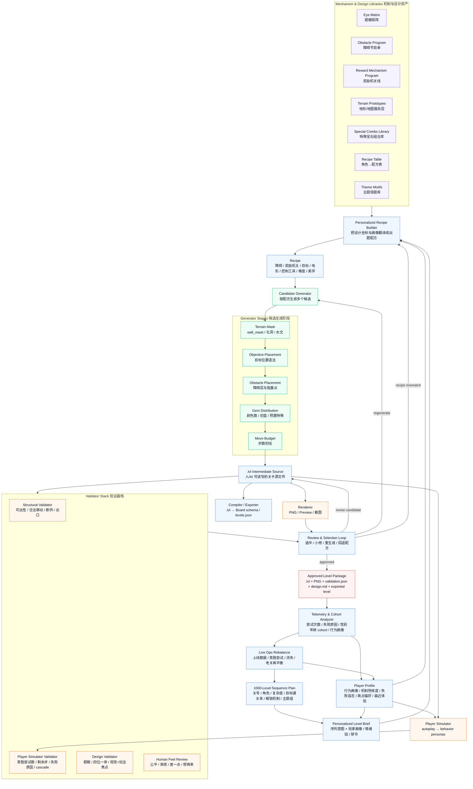

# 关卡生成架构设计 v0

> 2026-06-15 · 本文是 `level-design-master.md` 与 `level-design-overview.md` 之后的下一层架构设计。
> 目标：把“每关是一道题 / 四位一体的形状 / 补给水文 / 复杂度阶梯 / 生成后验证”落成一套可用于 20 关验证包、之后可扩到 1000 关的关卡生成流水线。
>
> 范围：本文只设计架构与数据流，不实现代码，不决定最终数值平衡。

---

## 0. 一句话结论

关卡生成不要做成“AI 直接吐 `levels.json`”。正确架构是：

> **序列坐标 + 玩家画像 → 障碍/奖励机制节目单 → 个性化出题配方 → 服务机制的地图 → 多候选生成 → `.lvl` 中间格式 → 渲染/玩家模拟/验证 → 人工/AI 定稿 → 导出引擎关卡**

也就是 **Recipe-led Candidate Generation with Validation Loop**：

- **Mechanism-led**：先定障碍与奖励机关的节目单，再让地形、目标、棋子分布为机制服务。
- **Recipe-led**：由人设计的题眼、障碍、奖励机关、地形、特殊宝石组合、主题库约束生成，保证关卡有设计意图。
- **Candidate Generation**：每个配方生成多个候选，不把第一次输出当成最终关。
- **Validation Loop**：用结构检查、玩家模拟、视觉/设计评审、人工手感评审把坏候选筛掉。
- **Human-in-the-loop**：机器负责跑量和初筛，人负责品味、题眼、节奏、爽感。
- **Personalized-by-design**：同一个序列坐标可以生成不同关卡实例；“第 N 关”代表学习目标和运营节奏，不代表所有玩家看到完全相同的棋盘。

---

## 0.1 核心修正：机制先于地图

新的架构重心是：

> **关卡的主角不是地图，而是“障碍 + 奖励机关”的组合。地图是让这些机制成立、可读、好玩、好看的舞台。**

因此做一关时，顺序不能是：

```text
先画一个地形 → 再往上撒障碍
```

而应该是：

```text
先定本关要让玩家处理什么障碍/奖励机关
  → 再定它们要形成什么题眼
  → 再选择最能服务这个题眼的地形/水文
  → 最后摆目标、棋子、步数和主题
```

地图仍然重要，但它的职责变成三件事：

1. **承载机制**：给障碍和奖励机关提供正确位置，例如瓶颈、死水、端点、轨道、金库。
2. **定义补给拓扑**：决定棋子从哪里来、往哪里落、区域之间是否串联补给。
3. **放大机制**：让同一个障碍因为位置不同产生不同题眼，例如晶壳放在边角、咽喉、孤岛外圈，体验完全不同。
4. **解释机制**：让玩家第一眼看懂“为什么要先救这个、先连这里、先开这道门”。

一句话：

```text
障碍/奖励机关 = 内容主菜
地图/地形 = 烹饪方式和摆盘
目标/步数/颜色 = 调味与平衡
```

---

## 0.2 已定产品约束：长期运营、魔法萌宠、千人千面

本架构按以下产品判断推进，除非后续明确改口：

1. **运营形态**：目标不是一次性解谜包，而是接近头部长线三消的长期关卡运营。关卡系统要支持持续加机制、旧机制复用、难度再平衡和分人群变体。
2. **主题气质**：Polaris 的包装是 **魔法世界 + 萌宠**。机制命名、奖励机关和视觉解释应服务“魔法/星光/旅伴/宠物”语境，不能沿用外部竞品名。
3. **目标用户**：美国中年女性为主，男性也覆盖。没有真实数据时，允许使用弱性别冷启动先验：女性默认更偏休闲、新鲜度、萌宠与特效反馈；男性默认更偏挑战、策略、机制深度。该先验只用于冷启动，真实行为数据一出现就覆盖它。
4. **难度定义**：难度不再是“能不能卡住”，而是 **玩家模拟器代表某类玩家时，需要模拟多少次/多少局能过**。关卡难度由通过尝试分布、首胜尝试数、剩余步数分布、失败原因分布共同定义。
5. **宠物技能边界**：宠物技能承担道具功能，但 v0 关卡生成先不把宠物技能纳入核心求解闭环；只预留 `pet_skill_context` 字段，避免一次性复杂度爆炸。
6. **机制库策略**：不同关卡可以有不同机制；初始要先定义可扩展的 Mechanism Kit Contract，后续可以继续加机制，而不是把 v0 机制写死成唯一全集。
7. **千人千面**：长期目标是不同玩家拿到不同关卡实例。系统要把“关卡序列坐标”和“具体棋盘实例”拆开：同一关号可以保持相同教学/运营意图，但棋盘、障碍强度、奖励机关、步数和目标量可按玩家画像调整。

默认个性化原则：

```text
同一 Level Coordinate = 同一学习目标 / 同一运营节奏 / 同一主题段
不同 Level Instance = 不同棋盘实例 / 不同机制强度 / 不同奖励安全阀 / 不同步数与目标量
```

这能保留长期运营的可控性，又允许千人千面。

---

### 0.3 执行闭合决策：v0 不再留空

本轮闭合后，v0 先按以下可执行口径推进，不再等待额外决策：

1. **物理 `.lvl` 采用 Strict JSON Profile**：扩展名仍为 `.lvl`，内容是标准 JSON。文档里的 YAML 代码块只作为说明性伪码；进入工具链的源文件必须是 JSON。原因是现有 Godot/工具链已有 JSON 路径，先闭合执行，不引入 YAML 依赖。
2. **最小工具链落地在 `tools/level_tool.py`**：提供 `lint / compile / validate / simulate / ascii` 五个命令；先输出 Godot 现有 `levels.json` 单关 record。Godot 渲染 wrapper 后补，不阻塞关卡源文件、结构验证与玩家模拟。
3. **前 10 关由程序生成真实 `.lvl`**：`tools/level_tool.py generate --through 10 --out-dir levels_src` 生成 `levels_src/level_001_base.lvl` 到 `level_010_base.lvl`；生成后必须能 compile/validate/simulate。
4. **第 5 关口径统一为 crystal_shell practice / pressure-lite**：它不是爽关；它负责第一次让玩家理解“晶壳门改变补给水文”。爽关后移到第 6 或第 10。
5. **v0 可玩机制只用 engine-backed 子集**：`target_mark / crystal_shell / drop_relic / creep_growth / spawner / timed_core`；`collect/order_color` 虽然引擎支持，但生成关暂不把“某色棋子数量”作为主通关条件，因为它不够主题化、读起来像任务清单，不像关卡题眼。
6. **早期 playable 地形必须补给安全**：障碍可以阻拦下落，但前 20 关不允许“下方可玩区悬在洞/墙下面”造成玩家以为会补棋却实际断供。漂亮形状必须先过 supply reachability。
7. **玩家模拟器 v0 先是可解释启发式**：1-step move scoring + persona 权重 + noise；不追求最优解，不上深搜。

闭合判断标准：

```text
Level Coordinate 数据表 → generate 出 .lvl → lint 通过 → compile 成 Godot record → validate 结构通过 → simulate 输出画像指标 → design_claim 能解释题眼
```

---

## 1. 设计目标与非目标

### 1.1 目标

1. **支持 20 关手搓验证包**  
   先验证方法论，不急着规模化。

2. **为 1000 关规模化预留架构**  
   关卡不是手写孤例，而是从序列规划、障碍节目单、奖励机关线、库、配方、验证闭环里生产出来。

3. **保留设计感**  
   每关必须有题眼，有“抽掉就塌”的设计核心。

4. **支持机制驱动的四位一体**  
   障碍/奖励机关决定题眼；地形负责把题眼变成玩法地理、视觉构图、直觉指引和主题表达。

5. **让 AI 和人都能编辑/审查**  
   使用 `.lvl` 作为人类可读、AI 可读、可渲染、可求解的中间格式。

6. **可验证**  
   每个候选必须输出设计声明、结构验证结果、玩家模拟指标、人工/AI 评审结果。

### 1.2 非目标

1. 不做最终 GUI 编辑器。
2. 不做一次性 1000 关生成。
3. 不直接依赖旧 `levels.json` 内容。
4. 不用旧 overlay 概念主导设计；overlay 只是引擎能力映射。
5. 不追求纯自动生成，先追求人机协作下的高质量生成。
6. 不在 v0 引入复杂新障碍、新操作或重型 meta 系统。

---

## 2. 术语边界：设计语言必须项目原生

本文采用两层命名：

1. **设计层术语**：给策划、人、AI 讨论关卡使用，必须是 Polaris/gem 语境下的名字。
2. **引擎适配层字段**：为了复用现有 Godot 实现，暂时映射到 `jelly`、`coat`、`choco` 等历史字段。

规则：

- 设计文档正文使用 **target_mark / 目标印记**，不使用竞品覆盖目标名。
- 设计文档正文使用 **crystal_shell / 晶壳**，不使用 `coat` 作为设计名。
- 设计文档正文使用 **creep_growth / 蔓生**，不使用 `choco` 作为设计名。
- 设计文档正文使用 **drop_relic / 迷路幼兽**，不使用外部运输目标名作为设计名。
- `jelly` / `coat` / `choco` / `ing` 只允许出现在“引擎映射”列或代码字段里。
- 外部竞品只作为研究对象出现，不作为 Polaris 的术语来源。

---

## 3. 总体架构

```text
┌────────────────────────────────────────────────────────────┐
│                    1000-Level Sequence Plan                │
│  关号 / 角色 / 复杂度 / 目标通关率 / 解锁机制 / 主题组         │
└──────────────────────────────┬─────────────────────────────┘
                               │
                               ▼
┌────────────────────────────────────────────────────────────┐
│                      Player Profile                        │
│  行为画像 / 机制熟练度 / 失败容忍 / 爽点偏好 / 最近体验记忆     │
└──────────────────────────────┬─────────────────────────────┘
                               │
                               ▼
┌────────────────────────────────────────────────────────────┐
│                    Personalized Level Brief                 │
│  序列目标 + 玩家画像：这一关给这个玩家训练什么、调到什么强度     │
└──────────────────────────────┬─────────────────────────────┘
                               │
                               ▼
┌────────────────────────────────────────────────────────────┐
│                 Personalized Recipe Builder                 │
│  从机制节目单选障碍/奖励机关，再按玩家画像调题眼/地图/目标/强度  │
└──────────────────────────────┬─────────────────────────────┘
                               │
                               ▼
┌────────────────────────────────────────────────────────────┐
│                    Candidate Generator                     │
│  按配方生成 N 个候选 .lvl，每个候选附带 design_claim           │
└──────────────────────────────┬─────────────────────────────┘
                               │
                               ▼
┌────────────────────────────────────────────────────────────┐
│                    Intermediate .lvl Format                 │
│  人/AI 可读写；可编译为 Board schema；可渲染、可模拟、可 diff    │
└──────────────────────────────┬─────────────────────────────┘
                               │
                 ┌─────────────┼─────────────┐
                 ▼             ▼             ▼
        ┌──────────────┐ ┌──────────────┐ ┌──────────────┐
        │  Renderer    │ │Player Sim   │ │  Validators  │
        │  PNG/Preview │ │画像模拟试玩  │ │ 结构/设计/数值 │
        └──────┬───────┘ └──────┬───────┘ └──────┬───────┘
               └───────────────┬┴───────────────┘
                               ▼
┌────────────────────────────────────────────────────────────┐
│                    Review & Selection Loop                  │
│  画像模拟指标 + AI 设计评审 + 人工手感评审 → 选中/修改/重生成    │
└──────────────────────────────┬─────────────────────────────┘
                               │
                               ▼
┌────────────────────────────────────────────────────────────┐
│                  Approved Level Package                     │
│  .lvl 源文件 + 渲染图 + 验证报告 + 设计说明 + 导出 levels.json   │
└────────────────────────────────────────────────────────────┘
```


### 3.1 架构图（Mermaid）



---

### 3.2 个性化生成闭环：同一关号，不同实例

千人千面不是让每个玩家进入完全不同的游戏，而是把关卡拆成两层：

```text
Level Coordinate（运营层）
  = 第几关 / 什么角色 / 解锁什么机制 / 这段情绪节奏 / 目标难度带

Level Instance（实例层）
  = 给某个玩家生成或选择出来的具体棋盘 / 目标量 / 步数 / 机制强度 / 奖励安全阀
```

闭环如下：

```text
玩家历史表现
  → Player Profile 行为画像
  → Personalized Level Brief
  → 生成多个候选实例
  → 用对应画像的 Player Simulator 跑“多少次能过”
  → 选择最贴合目标难度带的实例
  → 玩家真实游玩
  → 更新画像与关卡库统计
```

这样第 37 关对所有人仍然是“第 37 关”：同一主题段、同一机制进度、同一运营节奏；但对于不同玩家，它可以是不同棋盘。

**难度节奏不由单关临时决定，而由 Level Coordinate 的 `target_pass_band` 决定。**  
v0 先把 `simulated_pass_rate_at_1` 当作可执行难度口径：通过率越高越轻松，通过率越低越困难。每个关卡坐标都必须声明一个目标通过率带；候选实例如果低于下限，说明太难，如果高于上限，说明太简单，二者都不能进入最终关卡包。

前 10 关的节奏采用“教学高通过 → 小变化 → 压力 → 喘息 → 压力峰 → 新机制教学 → 混合压力”的锯齿结构，而不是线性递增：

| 关卡段 | 作用 | `simulated_pass_rate_at_1` 目标 |
|---|---|---:|
| 1 | 基础教学 | 0.92-1.00 |
| 2 | 同机制换位置 | 0.78-0.92 |
| 3 | 新通关条件教学 | 0.90-1.00 |
| 4-5 | 第一次机制压力 | 0.68-0.85 / 0.58-0.80 |
| 6 | 喘息爽关 | 0.90-0.99 |
| 7-8 | 机制压力与变体 | 0.55-0.75 / 0.65-0.85 |
| 9 | 迷路幼兽教学 | 0.90-1.00 |
| 10 | 幼兽 + 晶壳混合压力 | 0.55-0.75 |

### 3.3 个性化不变量与可变量

为了避免千人千面失控，系统必须区分不变量和可变量：

| 层级 | 是否个性化 | 说明 |
|---|---|---|
| level_id / sequence role | 不个性化 | 保持运营节奏、活动、内容进度可控 |
| 新机制引入顺序 | 基本不个性化 | 防止玩家缺课；可用不同例子教学 |
| 主题段 / 魔法世界包装 | 基本不个性化 | 保持内容资产复用和品牌一致 |
| 棋盘实例 | 个性化 | 形状、孔洞、目标位置、障碍强度可变 |
| 目标量 / 步数 / 颜色数 | 个性化 | 用于把模拟首胜尝试数拉进目标带 |
| 奖励机关安全阀 | 个性化 | 困难玩家给更早、更清晰、更强的破局点 |
| 机制组合密度 | 个性化 | 熟练玩家可混合更多旧机制 |
| 宠物技能 | v0 暂不个性化求解 | 只作为未来上下文，不进入核心关卡难度定义 |

默认策略：**同一关号保持同一主机制和同一学习目标，但允许实例层调整难度与爽点。**

### 3.4 反馈系统闭环：从冷启动先验到真实后验

反馈系统要回答两类问题：

1. **单关是否有问题**：某一关流失严重，是不是太难、不可读、太磨、奖励不够，还是机制没被理解？
2. **人群是否不同**：女性/男性、不同年龄、不同熟练度玩家喜欢的关卡设计是否不同，行为是否不同？

闭环：

```text
玩家真实游玩事件
  → Level Telemetry
  → 失败原因/爽点/机制使用诊断
  → Cohort Analyzer（性别/年龄/地区/行为画像对比）
  → 更新 Player Profile 权重
  → 更新关卡生成策略 / 旧关再平衡 / 后续关卡配方
```

最小埋点：

| event / metric | 用途 |
|---|---|
| attempts_to_win | 判断“多少次能过”，替代单纯卡/不卡 |
| quit_before_loss | 识别主动流失，不只看失败 |
| fail_reason | 区分步数不够、目标不可读、机制没触发、死局、奖励太弱 |
| target_touch_turn | 目标首次被触达的回合；太晚说明不可读或太远 |
| mechanism_activation | 关键机关是否被触发 |
| reward_payoff_value | 奖励机关是否真的带来目标进度/爽感 |
| pet_skill_used | 宠物技能是否成了事实道具；v0 只记录，不纳入基础难度 |
| session_return_after_level | 某关后是否继续玩/次日回来 |
| cohort | 性别/年龄/地区等分析维度；不能单独决定个体长期画像 |

单关诊断例子：

| 信号 | 可能解释 | 调整方向 |
|---|---|---|
| 大量玩家没触达目标就退出 | 开局不可读 / 目标太远 | 强化视觉焦点、降低第一层阻碍、提前奖励提示 |
| 多数失败发生在机制触发前 | 机制激活成本太高 | 降低晶壳层数、给更大操作区、加早期安全阀 |
| 机制已触发但仍失败 | 回报太弱或收尾太磨 | 提高 payoff、减少尾盘目标量、加 cascade 空间 |
| 女性 cohort 高退出、男性正常 | 冷启动女性先验可能需要更强新鲜度/反馈/低挫败 | 给 female-prior 变体更多萌宠反馈、奖励机关、可读提示 |
| 男性 cohort 高退出、女性正常 | 可能缺挑战策略或前期太无聊 | 给 male-prior 变体更明确策略目标、紧一点步数或高阶组合 |
| 两性都高退出 | 不是性别差异，是关卡本身坏 | 回退配方或重做题眼 |

反馈系统红线：

- 性别分析用于发现 cohort 差异，不用于永久限制玩家内容。
- 如果某个男性玩家实际表现得像休闲玩家，应进入休闲行为画像；如果某个女性玩家实际喜欢策略挑战，应进入策略行为画像。
- 行为证据永远高于人口先验。

---

## 4. 核心数据对象

### 4.1 Sequence Plan：全局关卡序列

Sequence Plan 是 1000 关骨架。它不描述棋盘细节，只描述“这一关在长线体验里扮演什么角色”。

```yaml
level_id: 37
role: pressure              # teaching | variation | pressure | peak | breather
complexity_tier: 2          # 0..5
expected_duration_sec: 90
difficulty_target:
  attempts_to_first_win: [1.5, 3.0]
  simulated_pass_rate_at_3: [0.60, 0.80]
mechanics_unlocked:
  - target_mark
  - crystal_shell
  - line_gem
  - burst_gem
theme_group: forest_ruins
player_skill_focus:
  - make_vertical_line_gem
  - open_bottleneck
emotional_beat: "中段卡住，纵向线消打穿后爽快清下游"
notes: "难关前的施压关，不应成为硬墙。"
```

#### role 定义

| role | 作用 | 难度倾向 | 设计要求 |
|---|---|---:|---|
| teaching | 新机制第一次出现 | 低 | 只引入一个新变量，几乎不会输 |
| variation | 已学机制换形状 | 中低 | 新鲜但不压迫 |
| pressure | 要认真规划 | 中高 | 有题眼，有可见破局路径 |
| peak | 小墙/记忆点 | 高 | 可难，但必须公平，有“差一点” |
| breather | 喘息/爽关 | 低中 | 连锁多，释放压力 |

---

### 4.2 Player Profile：玩家行为画像

Player Profile 是个性化生成的输入。它不是人口标签表，而是“这个玩家在关卡里如何做决定”的近似。性别、年龄、地区在 v0 可以作为冷启动 cohort prior，但只能给起始权重；真实行为数据优先。

```yaml
player_profile:
  profile_id: p_anon_42
  cohort_priors:
    market: US
    age_band: middle_age
    gender_signal: female_cold_start_prior       # female | male | unknown；冷启动用，行为数据优先
    prior_confidence: low                         # 不把性别当确定事实

  behavior_axes:
    goal_focus: 0.62              # 是否优先看目标/障碍，而不是只找可消
    bottom_bias: 0.48             # 是否偏好底部消除制造 cascade
    special_gem_intent: 0.55      # 是否主动制造/保留特殊宝石
    mechanism_literacy:
      crystal_shell: 0.70
      creep_growth: 0.20
      drop_relic: 0.35
      star_circuit: 0.00
    risk_tolerance: 0.40          # 愿不愿意赌 cascade/远期收益
    frustration_tolerance: 0.45   # 连续失败后还能接受多硬
    reward_preference: 0.75       # 对明显爽点/帮手机关的偏好

  recent_memory:
    last_failed_mechanisms: [drop_relic]
    last_success_mechanisms: [target_mark, crystal_shell]
    recent_attempts_to_win: [1, 2, 4, 1, 3]
    recent_quit_causes: [low_target_progress]

  personalization_budget:
    allowed_adjustments: [moves, target_quantity, obstacle_layers, reward_safety_valve, board_instance]
    forbidden_adjustments: [skip_required_new_mechanic]
```

Profile 更新规则：

- 玩家真实数据没来之前，用 **cold-start cohort priors + behavior personas** 初始化。
- 性别先验只影响起始权重，不代表个体真实性格；一旦有行为数据，行为数据优先。
- 玩家每打一关，用尝试次数、失败原因、目标触达时间、是否使用宠物技能、是否退出更新画像。
- 画像服务于“给他/她一个更合适的关卡实例”，不是服务于贴标签。

#### 4.2.1 冷启动性别先验

无真实数据时，可以用以下弱先验启动 Player Profile。注意：这是产品假设，不是心理学结论；必须在上线后用真实行为校正。

| cold_start_prior | 默认偏好假设 | 关卡生成倾向 | 不允许做的事 |
|---|---|---|---|
| female | 更偏休闲节奏、萌宠反馈、特效爽感、关卡新鲜度、低挫败 | 更清晰目标、更早奖励机关、更多视觉反馈、少一点惩罚型动态压力 | 不允许降低策略深度上限；不允许只给“简单关” |
| male | 更偏挑战、策略、机制破解、组合深度、可控难关 | 更紧步数、更高机制组合密度、更少安全阀、更多 order/key/route 型题眼 | 不允许默认给硬核挫败；不允许忽略美术/萌宠反馈 |
| unknown | 平衡 | base 画像：目标清晰 + 轻策略 + 适度爽点 | 不做极端难度 |

冷启动先验的使用边界：

```text
gender_prior_weight <= 0.20
behavior_evidence_weight starts at 0.00 and rises with play history
if behavior_evidence_count >= threshold: behavior overrides gender prior
```

也就是说：性别只负责“第一批关卡怎么猜”，不负责“长期怎么定义这个玩家”。

---

### 4.3 Personalized Level Brief：个性化单关设计坐标

Personalized Level Brief 是 Sequence Plan 与 Player Profile 的交集，回答“这个序列坐标对这个玩家为什么存在”。

```yaml
id: level_037_profile_a
source_sequence_id: 37
player_profile_ref: p_anon_42
intent: "训练玩家用纵向线消穿过窄口，净化下游目标印记。"
player_question: "我如何把上游随机宝石转化成能打到下游的控制力？"
primary_emotion: "先看懂瓶颈，再打穿，最后清场"
forbidden:
  - pure_color_collection
  - no_obstacle_board
  - hard_by_moves_only
personalization_policy:
  keep_invariant:
    - primary_mechanic
    - teaching_goal
    - theme_group
  may_adjust:
    - move_budget
    - target_quantity
    - obstacle_density
    - reward_safety_valve

required_design_claims:
  - has_eye
  - visual_focus_equals_play_focus
  - one_shape_four_roles
```

---

#### 4.3.1 玩家上下文导演补充

`Personalized Level Brief` 的线上来源不应长期停留在 cold-start persona。完整闭环见 [`level-design-player-context-director.md`](level-design-player-context-director.md)：

```text
PlayerContext
  → RhythmState(tutorial/practice/variation/pressure/breather/finale)
  → NextLevelBrief
  → generate N candidates
  → validate
  → simulate(persona mix + context profile)
  → select
  → record assigned instance
```

执行边界：

- `level_coordinate` 是学习/运营坐标，不等于所有玩家同一棋盘。
- `PlayerContext` 记录已玩关卡、attempts、pass/fail、剩余步、失败原因、机制触发率、最近 N 关节奏和画像轴。
- `RhythmState` 负责避免连续新机制、连续卡关、连续无爽点。
- `NextLevelBrief` 必须输出主角机制、机制 lifecycle phase、目标通过率区间、奖励预算、烦躁预算、棋盘大小和禁令。
- `generate-select` 是当前最小候选闭环；后续需要读取 `NextLevelBrief` 并写入 assigned instance。
- 玩家真实行为证据覆盖 `female_prior` / `male_prior` / `unknown` 冷启动先验；冷启动只决定第一批猜测权重。

### 4.4 Recipe：出题配方

Recipe 是生成器真正消费的核心对象。它不是棋盘，而是“本关机制应该如何落到棋盘上”的约束集合。先写障碍/奖励机关，再写地形，因为地形服务机制。

```yaml
recipe_id: cleanse_marks_hourglass_expedition_t2
level_id: level_037

obstacle_lane:
  focus: crystal_shell
  stage: practice
  active: [target_mark, crystal_shell]
  forbidden: [creep_growth, spawner, timed_core]

mechanism_lane:
  focus: none
  stage: none
  payoff_budget: low

objective:
  type: cleanse_marks
  quantity_band: medium
  placement_rule: downstream_dead_zone

terrain:
  prototype: hourglass
  width: 9
  height: 9
  bottleneck_width: 2
  upstream_area: large
  downstream_area: medium
  symmetry: vertical

supply_topology:
  type: vertical_down
  special_rules: []

obstacles:
  max_types: 2
  primary:
    type: target_mark
    placement: downstream_pool
    layers: 1
  secondary:
    type: crystal_shell
    placement: bottleneck_gate
    layers: 1

control_tools:
  desired_specials:
    - vertical_line_gem
  desired_combos: []
  preplaced_specials: 0
  color_count: 5

solution_shape:
  intended_path:
    - "上游制造纵向线消"
    - "纵向线消打穿窄口晶壳门"
    - "下游补给恢复，cascade 净化目标印记"
  fail_modes:
    - "只在上游乱消，无法清下游"
    - "先清边缘低价值区，步数不足"

difficulty:
  cognitive: medium
  execution: medium_high
  move_slack_s: 1.30
  target_attempts_to_first_win: [1.5, 3.0]  # 个体口径：玩家画像模拟多少局内首胜
  target_simulated_pass_rate_at_3: [0.60, 0.80]
  max_reshuffle_rate: 0.08

personalization:
  profile_band: mechanism_learning
  adjust_knobs:
    moves: [-2, +4]
    target_quantity: [-20%, +15%]
    obstacle_layers: [-1, +1]
    reward_safety_valve: [none, early, strong]
  selection_rule: "选择 Player Simulator 首胜尝试数落在目标带、且机制使用率达标的候选"

aesthetic:
  theme_motif: "沙漏遗迹"
  visual_focus: "中央窄腰与下游印记池"
  readability_rule: "最窄处必须一眼可见，下游目标必须集中成视觉重量"
```

---

### 4.5 Candidate：候选关卡

Candidate 是 Recipe 的一次实例化。

```yaml
candidate_id: level_037_c03
recipe_id: cleanse_marks_hourglass_expedition_t2
source_file: levels_src/level_037_c03.lvl
preview_png: previews/level_037_c03.png

claims:
  eye: "下游目标印记被窄腰 + 晶壳门限制，必须先打穿补给咽喉。"
  one_shape_four_roles:
    gameplay: "沙漏窄腰制造水文瓶颈"
    beauty: "上下宽、中间收，稳定对称构图"
    readability: "窄腰自然提示关键阻塞点"
    theme: "沙漏/流沙主题"
  intended_climax: "纵向线消穿腰后，下游连续 cascade 净化印记。"

validation:
  structural: pending
  player_simulator: pending
  design_review: pending
  human_review: pending
```

---

## 5. 机制节目单与设计资产库

生成器的质量不来自“大模型神谕”，而来自库的质量。v0 先建小而硬的库。

---

### 5.1 题眼矩阵库 Eye Matrix

题眼 = 目标类型 × 阻碍方式。

#### 目标类型

| objective | 中文 | 设计价值 | v0 立场 |
|---|---|---|---|
| cleanse_marks | 净化目标印记 | 主菜，直观、项目原生 | v0 主力 |
| collect/order_color | 收集指定颜色 | 任务清单感强，主题弱 | 引擎支持，但生成关禁作主目标 |
| drop_relic | 运输/掉出口 | 路径规划强 | v0 重点验证 |
| order | 订单/指定组合 | 训练特殊宝石 | v0 后半段引入 |
| score | 凑分 | 最浅 | v0 少用或禁用 |

#### 阻碍方式

| obstacle_mode | 中文 | 核心体验 | 常配地形 |
|---|---|---|---|
| expedition | 远征 | 目标在下游/远端死水 | 沙漏、瓶颈 |
| siege | 围城 | 先破墙再触达目标 | 孤岛、中心金库 |
| split | 隔断 | 分区各自为战 | 分叉、断层 |
| harvest | 收割 | 分散目标靠大范围控制 | 大平原、花瓣 |
| assault | 攻坚 | 厚障碍/多层，但不只加血 | 堡垒、窄门 |
| reveal | 揭示 | 目标藏在覆盖物下 | 薄雾、地层 |
| precision | 精算 | 步数紧，路径明确 | 小棋盘、窄廊 |
| key | 钥匙 | 必须制造某种特殊控制力 | 机关门、锁孔 |
| chain | 连环 | 解 A 才能解 B | 阶梯、瀑布 |

v0 优先填这 8 个组合：

1. cleanse_marks × expedition
2. cleanse_marks × siege
3. drop_relic × expedition
4. drop_relic × split
5. clear_shells × cleanup
6. order × key
7. cleanse_marks × reveal
8. cleanse_marks × chain

---

### 5.2 Terrain Space：地形连续轴与命名采样点

地形是机制的舞台，不是独立主角。为了支撑 1000 关，不能把地形理解成“8 个可枚举形状”。更准确的模型是：

> **地形 = 连续轴上的一个采样点 + 可读轮廓名。**

命名原型（沙漏、瓶颈、孤岛等）仍然保留，但它们不是无限复用的模板，而是地形空间里的标记点。生成器真正采样的是连续轴；命名原型用于沟通、约束、视觉审核和人工设计。

---

#### 5.2.1 三条核心地形轴

```yaml
terrain_axes:
  connectivity_split:
    description: "棋盘被切割/隔断的程度"
    range: [0.0, 1.0]       # 0=全连通开阔, 1=完全隔断多区
  supply_path_length:
    description: "补给从生成处到目标处的路径长度/水文距离"
    range: [0.0, 1.0]       # 0=目标紧贴补给源, 1=远端死水
  visual_centroid:
    description: "视觉/玩法重心位置"
    enum: [center, edge, top, bottom, dual]
```

注意：`supply_topology` 不放进这三轴里；它是下一节的独立层。地形轴描述“空间分割与重心”，补给拓扑描述“棋子怎么流”。两者组合才构成完整地图。

---

#### 5.2.2 命名地形是采样点，不是枚举全集

以下数值是 v0 标定起点，后续通过 20 关验证、玩家模拟与人工数据校准：

```yaml
terrain_samples:
  open:
    axes: { connectivity_split: 0.0, supply_path_length: 0.2, visual_centroid: center }
    readable_name: "开阔场"
  hourglass:
    axes: { connectivity_split: 0.5, supply_path_length: 0.7, visual_centroid: center }
    readable_name: "沙漏"
  bottleneck:
    axes: { connectivity_split: 0.6, supply_path_length: 0.8, visual_centroid: center }
    readable_name: "瓶颈"
  island:
    axes: { connectivity_split: 0.7, supply_path_length: 0.6, visual_centroid: center }
    readable_name: "孤岛"
  fault:
    axes: { connectivity_split: 0.8, supply_path_length: 0.5, visual_centroid: dual }
    readable_name: "断层"
  fork:
    axes: { connectivity_split: 0.45, supply_path_length: 0.5, visual_centroid: dual }
    readable_name: "分叉"
  edge_deadzone:
    axes: { connectivity_split: 0.25, supply_path_length: 0.65, visual_centroid: edge }
    readable_name: "边缘死角"
  vault:
    axes: { connectivity_split: 0.55, supply_path_length: 0.55, visual_centroid: center }
    readable_name: "中心金库"
```

审查规则：如果两个命名采样点在三轴上几乎重合，就不能当成两个独立原型，必须合并或证明它们在补给拓扑/机制语法上不同。

例如：

- `hourglass` vs `bottleneck`：如果都只是“中央窄口”，就合并；只有当 hourglass 强调上下蓄水区、bottleneck 强调单通道门控时才分开。
- `fault` vs `split_columns`：不是同一层。`fault` 是空间断层采样点；`split_columns` 是补给拓扑。它们可以组合，但不能互相替代。

---

#### 5.2.3 地形仍要服务机制

地形选择规则：

```text
先问：本关主机制是什么？
再问：这个机制需要什么空间关系？
再在连续轴上选采样范围。
最后给采样点一个玩家可读的轮廓名。
```

例：

| 主机制 | 需要的空间关系 | 推荐轴区间 | 可读采样点 |
|---|---|---|---|
| 晶壳门 | 需要“被堵住的通道” | split 0.45-0.70 / path 0.55-0.85 | bottleneck / hourglass |
| 星轨回路 | 需要“两端 + 中间可被清线” | split 0.50-0.85 / centroid dual | fault / fork / vault |
| 星光幼兽 | 需要“被救出后能清一片” | split 0.35-0.70 / centroid center | vault / downstream_pool |
| 迷路幼兽 | 需要“路径、终点、分叉” | split 0.35-0.75 / path 0.50-0.90 | fork / bottleneck / track |
| 共鸣核心 | 需要“玩家能喂能量且 payoff 有价值” | split 0.20-0.65 / centroid center/edge | center_vault / edge_deadzone |

每个地形采样点必须包含：

```yaml
sample: hourglass
axes:
  connectivity_split: 0.5
  supply_path_length: 0.7
  visual_centroid: center
parameters:
  width: [7, 9]
  height: [7, 9]
  bottleneck_width: [1, 3]
  symmetry: [vertical, approximate]
plays_well_with:
  objectives: [cleanse_marks, drop_relic]
  mechanisms: [crystal_shell, flow_gate, star_circuit]
  supply_topology: [vertical_down, cascade_chamber, one_way_gate]
anti_patterns:
  - "窄腰太窄导致无可用移动"
  - "下游完全断供导致只能靠运气"
validation_focus:
  - supply_flow_through_bottleneck
  - downstream_reachability
  - reshuffle_rate
```

---

### 5.3 Supply Topology：补给拓扑 / 掉落方向设计

> 反馈修正：地图不只是“形状”和“孔洞”。在 match-3 里，棋子怎么掉、从哪里补、区域之间是否跨区补给，本身就是关卡设计。左右两个区域里，右边消掉后由左边补给，也是一种强机制语法。

补给拓扑回答四个问题：

```text
棋子从哪里生成？
棋子往哪个方向落？
不同区域之间是否连通？
某一区域被清空后，由谁给它补给？
```

它属于地图设计，但它服务机制。很多题眼不是来自“地形长什么样”，而是来自“补给怎么流”。

---

#### 5.3.1 基础拓扑类型

| topology | 中文 | 机制效果 | 适配题眼 |
|---|---|---|---|
| vertical_down | 垂直下落 | 最直觉，默认水文 | 基础清除、瓶颈、下游池 |
| split_columns | 分列独立补给 | 各列/各区互不支援 | 隔断、分区压力 |
| side_feed | 侧向补给 | 左区补右区 / 右区补左区 | 跨区依赖、救援、连通题 |
| cascade_chamber | 上游房间补下游房间 | 一个区域是另一区域水源 | 远征、死水、开门后爽点 |
| loop_feed | 环形/回流补给 | 棋子沿回路移动或补给 | 路径角色、星轨机关 |
| one_way_gate | 单向闸门补给 | 开门后才允许补给流入 | 流门、晶壳门、奖励释放 |
| teleport_feed | 传送补给 | 从入口跳到远端出口 | 高阶空间谜题，慎用 |

---

#### 5.3.2 侧向补给的设计价值

侧向补给可以制造非常强的“区域依赖”：

```text
左区 = 水源 / 操作区
右区 = 目标区 / 奖励区
右区清空后，不从上方补，而是由左区流入
```

玩家体验会变成：

> 我不是只清右边；我必须先让左边产生足够补给/特殊宝石，才能让右边活起来。

适合的机制配套：

| 主机制 | 侧向补给如何服务它 |
|---|---|
| target_mark | 右区目标印记被清后，需要左区补给继续形成消除 |
| crystal_shell | 左区先破门，右区才开始被喂入棋子 |
| star_circuit | 左右端点分别在两区，补给连通后电路/星轨成立 |
| route_companion | 角色从左区走向右区，补给方向解释路线 |
| resonance_core | 左区制造能量，右区核心吃到补给后爆发 |

---

#### 5.3.3 补给拓扑也是 Mechanism Kit 的字段

每个机制套件需要声明它喜欢什么补给拓扑：

```yaml
id: star_circuit
spatial_grammar:
  terrain: [fault, fork, vault]
  supply_topology:
    preferred: [side_feed, one_way_gate]
    forbidden: [fully_random_teleport]
  reason: "端点之间必须有可读的连通关系；补给方向要强化连线预期。"
```

关卡 Recipe 也要显式写：

```yaml
map:
  terrain: split_two_rooms
  supply_topology:
    type: side_feed
    source_region: left_room
    target_region: right_room
    trigger: crystal_shell_gate_opened
```

这样地图生成器不是只画左右两个房间，而是知道：**左房间是右房间的水源**。

---

#### 5.3.4 侧向补给关卡例子

```text
左区：开阔操作区，可制造特殊宝石
中间：晶壳门 / 流门
右区：目标印记 + 星轨端点
补给：右区消除后，由左区侧向流入
```

设计题眼：

```text
玩家必须先在左区制造控制力，打开中门，让左区补给流入右区，右区目标才会持续可清。
```

这比单纯“左右两个区域”强，因为区域关系被补给拓扑绑定了。

---

#### 5.3.5 验证指标

补给拓扑要单独验证：

| metric | 含义 |
|---|---|
| supply_reachability | 目标区是否能被补给触达 |
| source_dependency_rate | 目标区有多少消除依赖源区补给 |
| dead_zone_duration | 死水区平均持续多久 |
| gate_open_turn | 补给闸门平均第几步打开 |
| cross_region_cascade_rate | 跨区域连锁发生率 |
| topology_confusion_risk | 玩家是否看不懂补给方向 |

反模式：

- 补给方向不可读，玩家以为会从上方掉。
- 侧向补给太隐蔽，像 bug。
- 目标区长时间无棋子可动，只能等运气。
- 传送/跨区补给过早出现，破坏直觉。

---

### 5.4 障碍库 Obstacle Library

v0 原则：障碍少，但每个必须“赚得席位”。

每个障碍/机制条目都必须声明 `state_dynamics`，用于生成器难度归因和玩家模拟/验证策略：

| state_dynamics | 含义 | 状态空间风险 | 示例 |
|---|---|---|---|
| static | 只有玩家操作才改变盘面 | 低 | target_mark、crystal_shell、drop_relic、一次性 star_circuit、一次性 starlight_cub、特殊宝石 |
| self_evolving | 环境每回合自演化 | 中高 | creep_growth 蔓延、spawner 生成 |
| actor_moving | 盘面上存在会移动的实体 | 高 | route_companion 的力场推动型/自主移动型 |

规则：同一机制若有多个变体，`state_dynamics` 由变体决定。例如 route_companion 的“点亮赛道后瞬移/前进”可标为 `static`，但“每回合受力场推动”必须标为 `actor_moving`。


| obstacle | 引擎映射 | state_dynamics | 类型 | 设计作用 | v0 用法 |
|---|---|---|---|---|---|
| target_mark | `jelly` | static | 目标印记 | 净化主目标；设计层叫“印记”，引擎层暂映射到 `jelly` | 主力 |
| crystal_shell | `coat` | static | 晶壳/阻塞 | 提高局部硬度、卡咽喉；设计层叫“晶壳”，引擎层暂映射到 `coat` | 主力 |
| creep_growth | `choco` | self_evolving | 蔓生动态 | 不处理会蔓延；设计层叫“蔓生” | 谨慎少用 |
| spawner | `cannon` | self_evolving | 生成源 | 持续制造压力 | 后测 |
| timed_core | `bomb` | self_evolving | 倒计时核心 | 局部紧迫 | 后测，容易过硬核 |
| drop_relic | `ing` + `exit_cols` | static | 迷路幼兽 | 路径规划 | v0 重点 |

历史 overlay（mystery/popcorn/cake 等）不直接进入 v0 障碍库；启用前必须拆成独立 Mechanism Kit，并补齐 `state_dynamics`、空间语法、教学关和验证指标。

障碍条目 schema：

```yaml
id: crystal_shell
engine_layer: coat
category: static_blocker
state_dynamics: static
interaction:
  cleared_by: adjacent_or_on_match
  affected_by_specials: true
water_effect:
  blocks_supply: partial
  increases_local_hardness: true
best_positions:
  - bottleneck_gate
  - island_wall
  - vault_ring
anti_patterns:
  - full_board_spam
  - pure_hp_wall_without_solution
visual_rule: "必须让玩家一眼看出这是门/壳/阻塞，而不是随机装饰。"
```


---

### 5.5 Obstacle Program：障碍设计与编排线

> 反馈修正：障碍不能只是“障碍库”里几条静态记录。玩家长线体验里最明显的新鲜感，往往来自“隔一阵子出现一个新障碍”，以及“旧障碍之间开始混合”。因此架构里必须有一条独立的 **Obstacle Program**，专门管理障碍的发明、引入、变体、混合、回收和难度预算。

#### 5.5.1 障碍的定位

障碍不是越多越好，也不是简单加血。Polaris 的障碍要满足三个条件：

1. **改变玩家决策**  
   它必须让玩家改变“先消哪里 / 用什么特殊宝石 / 什么时候处理”的判断。

2. **不引入新操作**  
   玩家仍然只做交换、消除、制造特殊宝石。障碍只给这些动作附加意义。

3. **和水文/目标/特殊宝石产生交互**  
   单独摆着只是阻力；和地形、目标、控制工具咬合后才是设计。

障碍设计的标准句式：

```text
这个障碍迫使玩家 ______，否则 ______。
它最适合放在 ______ 地形位置。
它最怕/最吃 ______ 特殊宝石。
它和 ______ 目标组合时产生题眼。
```

例：

```text
晶壳迫使玩家先打开补给咽喉，否则下游目标印记无法稳定净化。
它最适合放在瓶颈、孤岛外圈、中心金库门口。
它最吃纵向线消/范围爆破。
它和目标印记组合时产生“先开门再净化”的题眼。
```

---

#### 5.5.2 障碍不是一个点，而是一条生命周期

每个障碍都要走完整生命周期：

```text
Introduce 教学亮相
  → Practice 单障碍练习
  → Vary 空间变体
  → Combine 与旧障碍混合
  → Pressure 成为施压关核心
  → Rest 暂时退场
  → Return 作为熟悉元素回归
```

| 阶段 | 作用 | 关卡要求 | 禁忌 |
|---|---|---|---|
| introduce | 第一次见 | 单变量、低压、几乎不会输 | 同时引入别的新东西 |
| practice | 巩固 | 同障碍换位置/换地形 | 只换数量 |
| vary | 变体 | 改水文位置、目标位置、空间形状 | 机制没变但装作新鲜 |
| combine | 混合 | 与一个旧障碍或旧目标咬合 | 一次混太多 |
| pressure | 施压 | 作为题眼核心 | 靠步数硬压 |
| rest | 休息 | 暂时不出现，让玩家喘息 | 连续刷屏疲劳 |
| return | 回归 | 和新机制重新组合 | 完全重复旧关 |

这条生命周期要写进 1000 关 Sequence Plan，而不是靠生成器随机抽。

---

#### 5.5.3 障碍家族：少发明，多变体

不要追求几十种互不相干的障碍。更专业的做法是设计少量“障碍家族”，每个家族有清晰交互，再通过位置、层数、触发条件、目标耦合制造变体。

v0 建议四个家族：

| 家族 | 设计层名字 | 核心问题 | 常见题眼 | v0 状态 |
|---|---|---|---|---|
| 覆盖目标 | target_mark 目标印记 | 目标要被净化 | 清除 / 揭示 / 收割 | 主力 |
| 静态阻塞 | crystal_shell 晶壳 | 路被堵住、补给受限 | 远征 / 围城 / 攻坚 | 主力 |
| 动态扩张 | creep_growth 蔓生 | 不处理会恶化 | 压力 / 防守 / 清源 | 中期引入 |
| 生成源 | spawner 生成源 | 持续制造干扰 | 清源 / 控场 / 连环 | 中后期引入 |
| 倒计时核心 | timed_core 倒计时核心 | 局部时间压力 | 精算 / 救火 | 慎用 |
| 运输目标 | drop_relic 迷路幼兽 | 路径规划 | 远征 / 分叉 / 出口 | 重点验证 |

注意：这里“家族”比“皮肤名”更重要。之后可以给晶壳换冰、石、藤、金属等视觉主题，但设计层仍是 crystal_shell。

---

#### 5.5.4 每个障碍条目的完整 schema

障碍库条目必须比现在更厚。建议 schema：

```yaml
id: crystal_shell
family: static_blocker
engine_mapping: coat
state_dynamics: static

player_read:
  plain_language: "这是一层壳，挡住下面或旁边的目标。"
  first_reaction: "我要先把它打掉。"

interaction_contract:
  cleared_by:
    - adjacent_match
    - special_hit
  blocks_supply: partial
  blocks_target_access: true
  can_stack_layers: true
  introduces_new_operation: false

best_terrain_positions:
  - bottleneck_gate
  - island_wall
  - vault_ring
  - downstream_lid

pairs_well_with:
  objectives:
    - cleanse_marks
    - drop_relic
  special_gems:
    - vertical_line_gem
    - burst_gem
  obstacle_families:
    - target_mark
    - creep_growth

anti_patterns:
  - "铺满全图，变成纯体力墙"
  - "放在无水文意义的位置，只是拖步数"
  - "多层过厚导致玩家只能等运气"

introduction_plan:
  first_level_role: teaching
  first_level_rule: "只出现晶壳 + 目标印记，不混动态障碍"
  first_mix_with: target_mark
  first_pressure_use: bottleneck_gate

metrics_to_watch:
  - first_hit_turn
  - clear_turn_distribution
  - special_hit_rate
  - difficulty_delta_when_removed
```

关键新增指标是：

```text
difficulty_delta_when_removed
```

也就是把某障碍移除后，通关率/平均步数是否明显变化。没有变化，说明它只是装饰；变化太大，说明它可能过硬。

---

#### 5.5.5 障碍混合不是随机叠加，而是“二元咬合”

玩家感觉“又有新东西”的来源，不一定是全新障碍，也可以是旧障碍的新组合。但混合必须有句法。

推荐混合规则：

```text
新障碍第一次出现：只和目标印记混
第二次：换地形，不加新障碍
第三次：和一个旧障碍混
第四次：进入 pressure 关
之后：休息几关，再和更新的机制组合回归
```

混合矩阵示例：

| A | B | 产生的题眼 | 适合地形 | 风险 |
|---|---|---|---|---|
| target_mark | crystal_shell | 先开门，再净化 | 瓶颈 / 金库 | 过多会磨 |
| target_mark | creep_growth | 一边净化，一边防扩张 | 开阔区 / 边缘 | 压力过强 |
| crystal_shell | drop_relic | 先开路，再运输 | 瓶颈 / 分叉 | 路径不清 |
| creep_growth | spawner | 清源，否则局面恶化 | 中心 / 边路 | 容易失控 |
| crystal_shell | timed_core | 救火 + 攻坚 | 小棋盘 | 可能太硬核 |
| target_mark | spawner | 干扰持续落入目标区 | 下游池 | 尾盘拖沓 |

v0 红线：**每关最多一个主障碍 + 一个副障碍**。第三种障碍只能作为极少量点缀，不能承担题眼。

---

#### 5.5.6 障碍引入节奏：玩家要“隔一阵子见新东西”

Sequence Plan 需要一条 obstacle lane：

```yaml
level_id: 005
obstacle_lane:
  introduced: []
  active: [target_mark, crystal_shell]
  mix_stage: crystal_shell.practice
  retired: []
```

前 30 关示例节奏：

| 关段 | 新鲜感来源 | 障碍策略 |
|---:|---|---|
| 1-3 | 目标印记 | 只教目标，不加阻塞 |
| 4-6 | 晶壳 | 第一次“先开路再净化” |
| 7-9 | 晶壳空间变体 | 边角、瓶颈、孤岛 |
| 10 | 喘息爽关 | 少障碍，给特殊宝石爽点 |
| 11-13 | 迷路幼兽 | 目标类型新鲜，少混障碍 |
| 14-16 | 晶壳 + 迷路幼兽 | 旧障碍服务新目标 |
| 17-19 | 蔓生 | 第一个动态压力 |
| 20 | 小峰值 | 目标印记 + 晶壳 + 轻蔓生 |
| 21-23 | 喘息/变体 | 降压，换地形 |
| 24-26 | 生成源 | 新动态元素，只单独教 |
| 27-30 | 生成源 + 旧障碍 | 进入组合期 |

这才解释了玩家体感里的：

> 每隔一阵子有新障碍；过几关开始和旧障碍混；然后又暂时退场，避免疲劳。

---

#### 5.5.7 生成器如何使用 Obstacle Program

Candidate Generator 不应该直接从障碍库随机抽，而要先读取 obstacle lane：

```text
Sequence Plan.obstacle_lane
  → allowed_obstacle_families
  → mix_stage
  → obstacle_budget
  → placement_grammar
  → candidate generation
```

示例：

```yaml
obstacle_lane:
  focus: crystal_shell
  stage: practice
  allowed_families: [target_mark, crystal_shell]
  max_obstacle_types: 2
  main_obstacle: crystal_shell
  support_obstacle: target_mark
  forbidden:
    - creep_growth
    - spawner
    - timed_core
  placement_grammar:
    crystal_shell: bottleneck_gate
    target_mark: downstream_pool
```

这样第 5 关的生成器就不会突然塞入蔓生或生成源，也不会把晶壳撒满全图。

---

#### 5.5.8 第 5 关用这套障碍设计怎么变得更完整

第 5 关不是单纯“下游有目标印记”，而是 **crystal_shell 的 practice/first pressure-lite 关**：

```yaml
level_id: 005
role: pressure_lite
obstacle_lane:
  focus: crystal_shell
  stage: practice
  introduced_before: [target_mark]
  active: [target_mark, crystal_shell]
  forbidden: [creep_growth, spawner, timed_core, drop_relic]

obstacle_design:
  main_obstacle: crystal_shell
  support_target: target_mark
  placement:
    crystal_shell: bottleneck_gate
    target_mark: downstream_pool
  intended_realization: "玩家先打掉晶壳门，恢复下游补给，再净化目标印记。"
```

这时第 5 关承担两个职责：

1. 继续巩固“目标印记是目标”。
2. 第一次让玩家理解“障碍物会改变补给水文”。

它就不只是一个瓶颈关，而是障碍节目单中的一个明确节点。

---

---

### 5.6 Reward / Field Mechanism Program：场内奖励机关线

> 反馈修正：关卡里的机制不只有“障碍”。有些棋盘元素本质上是 **奖励机关**：玩家先处理局部条件，随后机关反过来帮助玩家清场、连线、开路或制造特殊宝石。它们不是阻力，而是“可争取的场内盟友”。

外部同类游戏给出的启发是：

- 有些被冰/壳压住的角色，释放后会帮助清理大量区域。
- 有些线路/赛道目标，需要先点亮路径或打通通道，目标才会移动。
- 有些生成物会带来额外特效棋子，反过来帮助玩家处理大面积目标。
- 有些节点/电路类机关，激活两端或连通路径后，会清除中间区域。

这些都不该被归入“障碍”。它们应该成为独立的 **场内机制层**。

---

#### 5.6.1 奖励机关的定义

奖励机关 = 玩家用若干步完成局部条件后，棋盘给予一次确定性或半确定性帮助。

```text
局部投入 → 机关激活 → 棋盘反馈 → 打开局面 / 清理目标 / 制造爽点
```

它和障碍的区别：

| 类型 | 玩家感受 | 设计目的 | 例子抽象 |
|---|---|---|---|
| 障碍 | “它挡着我” | 制造约束 | 晶壳、蔓生、生成源 |
| 奖励机关 | “我可以利用它” | 提供破局点/爽点 | 释放帮手、连通电路、点亮赛道 |
| 目标 | “我要完成它” | 定义胜利条件 | 目标印记、迷路幼兽 |
| 特殊宝石 | “我制造的控制力” | 玩家主动工具 | 线消、爆破、色彩清除 |

奖励机关的关键不是“更强”，而是 **让玩家看到一个可追求的局部目标**：

> 我先花几步把这里打开，后面它会帮我清一大片。

---

#### 5.6.2 奖励机关的六种机制形态

##### A. Release Helper：释放帮手机关

玩家清掉包裹/冰封/晶壳后，释放一个场内帮手，帮手执行一次清理。

Polaris 原创表达：

```yaml
id: starlight_cub
中文名: 星光幼兽
state_dynamics: static
condition: 清掉包裹它的晶壳/目标印记
payoff: 释放一圈或一条星光，净化附近目标/削弱晶壳
best_use: 大量覆盖目标、早中期爽点、教学奖励
risk: payoff 太强会变成“只等机关”，太弱则没人愿意救
```

设计价值：

- 把“清障碍”变成“救一个东西”。
- 给玩家局部目标和情绪奖励。
- 可以和萌宠线自然连接。

##### B. Relay Link：连线/电路机关

棋盘上有两个或多个节点。玩家清除节点附近障碍或给节点充能后，节点连通，中间路径被清除或激活。

Polaris 原创表达：

```yaml
id: star_circuit
中文名: 星轨回路
state_dynamics: static
condition: 激活两个星轨端点，或清出端点之间的路径
payoff: 端点之间产生星光束，清除连线穿过的格子
best_use: 分叉、断层、瓶颈、中心金库
risk: 线路不可读会让玩家困惑
```

这对应你说的“电基连起来消除中间部分”的机制抽象。关键是：**节点本身不是障碍，节点是奖励触发器；周围障碍只是激活成本。**

##### C. Track / Route：赛道/路径机关

目标沿路径移动。玩家不是直接收集目标，而是点亮路径、清出通道、让目标前进。

Polaris 原创表达：

```yaml
id: relic_path
中文名: 星遗轨道
state_dynamics: static
condition: 清除路径上的阻塞或点亮轨道格
payoff: 幼兽沿轨道前进，到达出口后完成目标/释放奖励
best_use: 运输目标、分叉选择、长线规划
risk: 路径太长会拖沓，出口不清会迷惑
```

设计价值：

- 把“运输”从掉落物变成可读路径。
- 能天然制造“先看终点，再规划中段”的题眼。

##### D. Path Actor / Route Companion：路径角色机制

棋盘上有一个会移动的角色。玩家不是直接操控角色，而是通过消除、点亮路径、改变流向或清除阻塞，让角色向目标点前进。

它和普通 Track / Route 的区别是：

```text
Track / Route = 路径是主角
Path Actor = 角色是主角，路径是角色的舞台
```

外部同类游戏里，一类做法是“角色沿赛道前进，玩家点亮/打通赛道”；另一类做法是“角色受棋盘力场影响移动，玩家间接把它送到目标”。Polaris 应该吸收这个抽象，而不是继承外部角色或命名。

Polaris 原创表达：

```yaml
id: route_companion
中文名: 星路旅伴
variants:
  lit_track:
    state_dynamics: static
    condition: 点亮路径格后前进
  force_push:
    state_dynamics: actor_moving
    condition: 每回合/每次消除受力场推动
  gate_release:
    state_dynamics: static
    condition: 清除门段后自动进入下一段
payoff: 旅伴到达节点后完成目标，或释放一次小范围星光奖励
best_use: 分叉路线、终点规划、轻叙事目标、萌宠系统前置
risk: 路径不可读会困惑；移动太慢会拖沓；奖励太强会替玩家玩
```

路径角色有三种可选运动模型：

| 运动模型 | 玩家在做什么 | 适合体验 | Polaris 示例 |
|---|---|---|---|
| 点亮赛道 | 清路径/点亮格子，角色沿亮路走 | 规划终点、逐段推进 | 星路旅伴沿星轨回家 |
| 力场推动 | 每次消除/特殊宝石改变流向或推动一步 | 间接操控、轻解谜 | 风铃鼠被星风推向星果 |
| 开门放行 | 清掉门/壳后角色自动进入下一段 | 节奏明确、低困惑 | 幼兽穿过晶壳门进入目标池 |

设计价值：

- 让目标变成“护送/引导一个角色”，比纯收集更有情绪。
- 可以自然连接萌宠留存线。
- 能把地图从“形状”变成“路线剧场”：起点、终点、分叉、门、奖励节点都有意义。

##### E. Hatch / Spawn Reward：孵化/生成奖励

玩家处理一个源点，源点不制造麻烦，而是制造可用资源：特殊宝石、同色宝石、临时帮手。

Polaris 原创表达：

```yaml
id: star_nest
中文名: 星巢
state_dynamics: static
condition: 在星巢旁连续消除或用特殊宝石命中
payoff: 生成一枚小型特殊宝石/同色宝石/临时帮手
best_use: 教玩家制造控制力，给困难关安全阀
risk: 随机生成过强会破坏题眼
```

设计价值：

- 让生成源不只有负面版本。
- 可以成为“困难关里的公平破局点”。

##### F. Charge / Burst：充能爆发机关

机关被普通消除/特殊宝石命中后充能，满能量后释放一次强效果。

Polaris 原创表达：

```yaml
id: resonance_core
中文名: 共鸣核心
state_dynamics: static
condition: 被相邻消除或特殊宝石命中累计充能
payoff: 满能量后释放净化波/方向光束/局部重排
best_use: 中期核心原创机制，连接特殊宝石系统
risk: 充能规则必须极直觉，否则显得黑箱
```

设计价值：

- 把特殊宝石和场内机关咬合起来。
- 让玩家从“随机消除”转向“主动喂能量”。

---

#### 5.6.3 奖励机关条目 schema

奖励机关必须记录“激活成本”和“回报形状”。

```yaml
id: star_circuit
family: relay_link
中文名: 星轨回路
state_dynamics: static

player_read:
  first_reaction: "这两个端点好像能连起来。"
  clarity_rule: "端点、连线方向、会被清除的区域必须一眼可读。"

activation:
  trigger:
    - clear_adjacent_blockers
    - charge_endpoint
  required_nodes: 2
  can_be_triggered_by_specials: true
  introduces_new_operation: false

payoff:
  type: beam_clear
  shape: line_between_nodes
  affects:
    - target_mark
    - crystal_shell
    - creep_growth
  strength: medium

placement_grammar:
  best_terrain:
    - fault
    - fork
    - vault
    - bottleneck
  best_position:
    - across_dead_zone
    - across_center_gate
    - between_two_islands

combo_hooks:
  with_obstacles:
    - crystal_shell
    - target_mark
  with_special_gems:
    - line_gem
    - burst_gem

metrics_to_watch:
  - activation_rate
  - average_turn_to_activation
  - payoff_targets_cleared
  - difficulty_delta_when_removed
  - player_path_confusion_rate

anti_patterns:
  - "玩家看不出端点之间会连线"
  - "一激活就替玩家完成整关，剥夺操作感"
  - "激活成本太高，玩家不愿追"
```

路径角色还需要额外记录移动规则：

```yaml
id: route_companion
family: path_actor
中文名: 星路旅伴
state_dynamics: actor_moving

movement:
  model: lit_track        # lit_track | force_push | gate_release
  start_nodes: [left_entry]
  end_nodes: [star_home]
  moves_when:
    - track_segment_lit
    - adjacent_blocker_removed
  blocked_by:
    - crystal_shell
    - creep_growth

payoff:
  on_arrive: objective_progress
  optional_bonus: small_star_burst

readability:
  show_start: true
  show_destination: true
  show_next_step_hint: true

metrics_to_watch:
  - route_progress_rate
  - average_arrival_turn
  - stuck_rate
  - endpoint_confusion_rate
```

---

#### 5.6.4 奖励机关与障碍的关系

奖励机关必须和障碍形成“成本—回报”关系：

```text
障碍 = 激活成本 / 空间约束
奖励机关 = 破局回报 / 爽点触发器
```

例子：

| 障碍成本 | 奖励机关 | 回报 | 题眼 |
|---|---|---|---|
| 晶壳包住星光幼兽 | starlight_cub | 幼兽释放星光清附近目标 | 先救它，后清场 |
| 晶壳挡住两个端点 | star_circuit | 连线清中间区域 | 先开端点，再连通 |
| 蔓生覆盖轨道 | relic_path | 幼兽移动并触发奖励 | 先清轨道，再运输 |
| 晶壳/蔓生挡住路线 | route_companion | 角色抵达终点或释放奖励 | 先读终点，再打通路线 |
| 目标印记围住共鸣核心 | resonance_core | 充能爆发净化一圈 | 先喂核心，再扩散 |
| 生成源旁有晶壳 | star_nest | 生成特殊宝石 | 先开巢，再造控制力 |

这样设计后，关卡就不是“障碍堆在那儿”，而是：

> 玩家看见一个值得追的机关，障碍只是拿来保护/延迟/定价这个机关。

---

#### 5.6.5 机关引入节奏

Reward / Field Mechanism 也需要 lifecycle：

```text
Tease 预告
  → Teach 教学
  → Reward 爽关
  → Tax 加成本
  → Combine 和障碍混合
  → Mastery 成为高阶题眼
```

| 阶段 | 作用 | 关卡方式 |
|---|---|---|
| tease | 让玩家看到机关但不依赖 | 放一个低成本机关 |
| teach | 明确教触发条件 | 单机关、低压、强视觉提示 |
| reward | 让玩家爽一次 | 机关 payoff 明显偏强 |
| tax | 加一点激活成本 | 外面套晶壳/放在死水区 |
| combine | 与旧障碍混合 | 机关成为破局点 |
| mastery | 高阶题眼 | 必须规划激活顺序 |

前 30 关可插入：

| 关段 | 场内机关 | 用途 |
|---:|---|---|
| 1-6 | 无或极轻 | 先学基础目标/障碍 |
| 7-9 | starlight_cub | 第一次“救它会帮你” |
| 10 | starlight_cub 爽关 | 奖励感建立 |
| 11-13 | relic_path / route_companion | 路径/终点/角色移动意识 |
| 14-16 | relic_path + crystal_shell | 开路后运输 |
| 17-20 | star_circuit | 第一次连线清中间 |
| 21-23 | star_circuit + target_mark | 连线服务目标 |
| 24-30 | resonance_core | 特殊宝石与机关咬合 |

---

#### 5.6.6 对生成架构的影响

Sequence Plan 里除了 `obstacle_lane`，还要加 `mechanism_lane`：

```yaml
level_id: 017
role: teaching
obstacle_lane:
  active: [target_mark, crystal_shell]
  max_obstacle_types: 2
mechanism_lane:
  focus: star_circuit
  stage: teach
  allowed_mechanisms: [star_circuit]
  payoff_budget: medium
  activation_cost: low
  forbidden_mechanisms: [resonance_core, star_nest]
```

Recipe Builder 也要同时考虑：

```text
role + complexity
  → eye
  → terrain
  → obstacle_lane
  → mechanism_lane
  → payoff_budget
  → candidate
```

Validator 增加机关指标：

| metric | 含义 |
|---|---|
| activation_rate | 玩家模拟中机关被触发比例 |
| avg_activation_turn | 平均第几步触发 |
| payoff_value | 触发后清理目标/障碍数量 |
| overcarry_rate | 机关是否过强到替玩家完成整关 |
| ignored_rate | 玩家/模拟器是否完全不追机关 |
| confusion_risk | 机关触发关系是否不可读 |

---

#### 5.6.7 Polaris 的原创机关候选

v0 可以先设计四个原创机关：

1. **starlight_cub / 星光幼兽**  
   被晶壳封住。救出后释放一圈星光，净化附近目标印记。承担“场内奖励”的第一课。

2. **star_circuit / 星轨回路**  
   两个端点被激活后连线，清除中间路径。承担“连线机关”的第一课。

3. **route_companion / 星路旅伴**  
   沿星轨/力场/门段前进，玩家通过点亮路径或清阻塞护送它到终点。承担“角色化路径目标”的第一课。

4. **resonance_core / 共鸣核心**  
   被特殊宝石命中会充能，满后释放净化波。承担“特殊宝石 × 场内机关”的中期原创核心。

这四者分别对应：

```text
救援奖励 → 连线破局 → 路径角色 → 共鸣爆发
```

它们能把外部同类游戏里的“救出后帮忙 / 连通后清线 / 激活后爆发”抽象成 Polaris 自己的语言。

---
---

### 5.7 特殊宝石组合库 Special Combo Library

深度押在特殊宝石组合，不押在障碍数量。

| combo | 控制力形态 | 适合题眼 | 设计用途 |
|---|---|---|---|
| line + line | 十字精准 | 钥匙、边缘死角 | 打交叉点 |
| line + bomb | 大十字/宽线 | 收割、攻坚 | 爽点爆发 |
| line + color | 多线齐发 | 远征、清屏 | 打穿水文阻隔 |
| bomb + bomb | 大范围爆 | 围城、攻坚 | 破中央硬区 |
| bomb + color | 多点爆 | 分散收割 | 大面积清目标 |
| color + color | 全屏清 | peak/breather | 高爽点，慎用 |
| line + crystal | 定向超线 | 运输、瓶颈 | 保障关键路径 |
| bomb + crystal | 超范围爆 | 中心金库 | 终局高潮 |

每关不一定要指定 combo，但可以指定“希望玩家学会/倾向制造”的控制力形态。

---

### 5.8 配方表 Recipe Table

配方表把 role 翻译成生成约束。

| role | 复杂度 | 地形 | 障碍 | 特殊宝石 | 步数松紧 | 目标 |
|---|---:|---|---|---|---|---|
| teaching | 0-1 | 简单明显 | 1 种 | 可预置/明显引导 | 宽 | 几乎不输 |
| variation | 1-2 | 同机制新形状 | 1-2 种 | 自然生成 | 宽中 | 新鲜 |
| pressure | 2-3 | 有瓶颈/死水 | 2 种 | 需要主动制造 | 中紧 | 认真玩 |
| peak | 3-4 | 强题眼 | 2-3 种 | 关键组合 | 紧 | 公平难 |
| breather | 1-2 | 开阔爽 | 0-1 种 | 容易连锁 | 宽 | 解压 |

配方生成不是随机抽取，而是约束传播：

```text
role + complexity
  → allowed_eye_set
  → allowed_terrain_set
  → allowed_obstacle_set
  → allowed_solution_shape
  → move/color/objective bands
```

---

### 5.9 主题母题库 Theme Motifs

主题不只是换皮。主题必须解释形状。

| theme | 母题形状 | 适配地形 | 低成本点缀 |
|---|---|---|---|
| forest_ruins | 藤蔓、树根、遗迹门 | fork, island, vault | 叶片、藤蔓边框 |
| hourglass_ruins | 沙漏、流沙、时间裂缝 | hourglass, bottleneck | 沙粒、金色窄腰 |
| ice_cavern | 裂缝、冰层、冻结通道 | fault, edge_deadzone | 冰裂边缘 |
| crystal_workshop | 管道、阀门、传送口 | bottleneck, chain | 管道/齿轮点缀 |
| crystal_mine | 晶脉、矿洞、核心矿石 | vault, hanging | 晶体角标 |

主题条目必须标注动画成本：

```yaml
theme: hourglass_ruins
animation_cost: low
allowed_decoration:
  - sand_particles_static
  - gold_frame
  - hourglass_corner_icon
avoid:
  - dynamic_sand_simulation
```

---

## 6. `.lvl` 中间格式设计草案

`.lvl` 是架构命根子：人能读，AI 能改，工具能渲染，玩家模拟器能跑。

### 6.1 文件结构

```text
levels_src/level_037.lvl
previews/level_037.png
reports/level_037.validation.json
reports/level_037.design.md
```

### 6.2 `.lvl` 示例

`.lvl` 分两区：

1. `board`：给人眼和 AI 快速读形状，只表达地形、基础棋子、少量单层视觉标记。
2. `overlays` / `mechanisms`：给机器读叠层、机制激活逻辑、奖励回报和跨格关系。

```yaml
id: level_037
version: 0

meta:
  role: pressure
  complexity_tier: 2
  theme: hourglass_ruins

personalization:
  level_coordinate: 37
  profile_band: default_mid_skill
  cold_start_prior: female
  prior_weight: 0.20
  keep_invariant: [primary_mechanic, teaching_goal, theme_group]
  target_attempts_to_first_win: [1.5, 3.0]
  pet_skill_context: ignored_v0

objective:
  type: cleanse_marks
  target: all

rules:
  moves: 24
  colors: 5
  refill: random
  gravity: down

map:
  terrain:
    sample: hourglass
    axes:
      connectivity_split: 0.5
      supply_path_length: 0.7
      visual_centroid: center
  supply_topology:
    type: vertical_down
    special_rules: []

recipe:
  eye: cleanse_marks_x_expedition
  obstacle_lane:
    focus: crystal_shell
    stage: practice
  mechanism_lane:
    focus: none
    stage: none
  intended_control: vertical_line_gem

legend:
  ".": hole
  "o": random_gem
  "1-6": fixed_gem_color
  "~": visual_hint_or_empty_playable_cell

# 区一：只读形状与基础棋子，不承担完整叠层语义
board: |
  ..ooooo..
  .ooooooo.
  oooooooo.
  oooooooo.
  ...oo...
  ...oo...
  oooooooo.
  .oooooo..
  ..ooooo..

# 区二：结构化叠层与机制逻辑，机器以这里为准
overlays:
  - cell: [2, 4]
    layers: [target_mark]
  - cell: [3, 3]
    layers: [target_mark, crystal_shell]
  - region: downstream_pool
    cells: [[6,2], [6,3], [6,4], [6,5], [6,6], [7,3], [7,4], [7,5]]
    layers: [target_mark]
  - region: bottleneck_gate
    cells: [[4,3], [4,4], [5,3], [5,4]]
    layers: [crystal_shell]

mechanisms: []

design_claim:
  eye: "下游目标印记被窄腰晶壳门限制，必须打穿咽喉。"
  visual_focus: "中央晶壳窄腰 + 下方印记池"
  intended_solution:
    - "在上游制造纵向 line gem"
    - "用 line gem 打穿晶壳门"
    - "恢复下游补给，cascade 净化印记"
  crack_path:
    - read_bottleneck_gate
    - access_gate_by_vertical_line
    - activate_supply_recovery
    - payoff_downstream_cascade
    - convert_to_target_mark_progress
    - finish_remaining_marks
  climax: "纵向线消穿腰后，下游连锁爆发"
```

机制示例：

```yaml
mechanisms:
  - id: starlight_cub_01
    type: starlight_cub
    state_dynamics: static
    cell: [4, 4]
    activation:
      trigger: clear_surrounding_shell
      required_layers_removed: [crystal_shell]
    payoff:
      type: clear_radius
      radius: 2
      affects: [target_mark, crystal_shell, creep_growth]
```

### 6.3 token 设计原则

1. `board` 优先服务可读形状，不强行表达所有规则。
2. 同格叠层、机关激活逻辑、跨格连线、路径角色移动规则必须写进结构化区。
3. 如果 `board` 与 `overlays/mechanisms` 冲突，机器以结构化区为准，并报 lint warning。
4. `.lvl` 必须比 `levels.json` 更适合作为设计源文件。
5. `levels.json` 是导出物，不是人工/AI 主要编辑对象。

---

## 7. 生成器分层

### 7.1 Generator 不直接“想关卡”

生成器只做受约束的实例化：

```text
Recipe
  → Mechanism Plan Resolver
  → Terrain Mask Generator
  → Objective Placement
  → Obstacle / Reward Mechanism Placement
  → Initial Gem Distribution
  → Move Budget Estimator
  → Candidate .lvl
```


### 7.2 Mechanism Plan Resolver

输入：`obstacle_lane` + `mechanism_lane` + role/complexity。  
输出：本关主机制、副机制、激活成本、回报预算、禁用机制。

职责：

- 先决定本关是“障碍题”“奖励机关题”还是“障碍 × 奖励机关题”。
- 限制每关机制数量，避免早期混太多。
- 把机制需求翻译成地形与补给拓扑需求，例如“需要两个端点”“需要下游池”“需要瓶颈门”“需要左区侧向补给右区”。

失败回退：

- 机制太多 → 降副机制或改为喘息关。
- payoff 太强 → 降低奖励机关强度或提高激活成本。
- payoff 太弱 → 降低激活成本或换更有价值的位置。

### 7.3 Terrain Mask Generator

输入：地形原型 + 参数。  
输出：`wall_mask` / board holes。

职责：

- 生成沙漏/瓶颈/孤岛/分叉等形状。
- 保证连通性和基本补给可达。
- 控制对称性与视觉重心。

失败回退：

- 无合法移动 → 放宽孔洞。
- 下游完全断供 → 加宽瓶颈或减少障碍。
- 形状不可读 → 回退到更强对称/更大空区。

### 7.4 Objective Placement

输入：题眼 + 地形。  
输出：目标位置。

规则示例：

```text
hourglass + expedition + cleanse_marks
  → target_mark 放下游池
  → 少量 target_mark 放窄腰附近作为路径提示
  → 不把 target_mark 均匀撒满全图
```

### 7.5 Obstacle / Reward Mechanism Placement

输入：障碍库 + 地形语法 + 题眼。  
输出：障碍层。

规则示例：

```text
bottleneck + crystal_shell
  → crystal_shell 放咽喉，不铺满上游
  → 咽喉最多 1-2 层
  → 必须给上游留制造特殊宝石空间
```

### 7.6 Gem Distribution

输入：颜色数、预置特殊、破局路径。  
输出：初始棋子分布。

v0 原则：

- 不追求精确初盘解法。
- 必须避免开局无有效 move。
- 可在 teaching 关使用固定颜色引导。
- pressure/peak 关减少固定颜色，保留随机性。
- 预置特殊宝石要少用；用时必须服务教学或爽点。

### 7.7 Move Budget Estimator

输入：理论最小路径 + 复杂度 + slack。  
输出：moves。

粗略公式：

```text
moves = ceil(theoretical_min_moves * S + obstacle_tax + terrain_tax - special_help)
```

其中：

- `S` 是文档里的宽裕系数。
- `obstacle_tax` 由层数、覆盖率、动态障碍压力估算。
- `terrain_tax` 由死水/瓶颈/隔断程度估算。
- `special_help` 来自预置特殊宝石或易生成 combo。

v0 不要求准，只要求能给初值，再由玩家模拟器校准。

### 7.8 可执行 v0 生成算法：先模板化，后参数化

为了避免“流程有了但生成不了”，v0 生成器先不用自由生成，采用 **模板 + 约束填槽**。当前实现落在 `tools/level_tool.py generate`：

```text
Level Coordinate
  → 读取 role / eye / terrain / playable mechanisms
  → 选择 terrain_mask_template
  → 按 placement preset 放 objective
  → 按 obstacle preset 放 blocker
  → 根据 role 和 target_pass_band 选择 colors / moves / seed / candidate_tuning
  → 输出 strict JSON .lvl
```

#### 7.8.1 terrain_mask_template v0

| sample | width x height | board rows | 用途 |
|---|---|---|---|
| open_7x7 | 7x7 | `ooooooo` × 7 | teaching / breather |
| bottleneck_9x9 | 9x9 | `ooooooooo`, `ooooooooo`, `.ooooooo.`, `.ooooooo.`, `..ooooo..`, `..ooooo..`, `...ooo...`, `...ooo...`, `...ooo...` | 补给安全的上宽下窄 expedition / crystal_shell gate / drop path |
| edge_7x7 | 7x7 open + edge overlay preset | edge target / precision |
| island_9x9 | 9x9 open + center/vault overlay preset | siege / vault |
| fork_9x9 | 9x9 wall split + two downstream pools | drop split / resource split |

生成器 v0 只能从这些模板开始；如果要新地形，必须先加模板和结构验证规则。

#### 7.8.2 placement preset v0

| preset | 规则 |
|---|---|
| center_marks_7x7 | `target_mark` 放中心 2x3 |
| edge_marks_7x7 | `target_mark` 放四边非角落，避免新手角落不可读 |
| downstream_marks_9x9 | `target_mark` 放 bottleneck 下游池，窄口可放少量提示印记 |
| crystal_gate_9x9 | `crystal_shell` 放 bottleneck 窄口 2x3，hp=1，前 10 关不叠 2 层 |
| relic_direct_9x9 | `drop_relic` 放出口列正上方，`drop_exit` 放底行同列 |
| trail_marks_7x7 | `target_mark` 放成开阔路径，替代“指定颜色收集”教学 |
| soft_shell_clusters_7x7 | 少量 `crystal_shell` 散落在开阔盘，作为清障喘息关 |

#### 7.8.3 role default 数值

| role | colors | moves 基准 | target preset | blocker preset |
|---|---:|---:|---|---|
| teaching | 4 | 16-18 | 少量集中 | 无或 1 个显眼点 |
| variation | 4-5 | 18-22 | 换位置不加压 | 0-1 |
| pressure_lite | 5 | 22-24 | 下游集中 | 1 层晶壳门 |
| pressure | 5 | 24-28 | 下游/分区 | 主障碍 + 副目标 |
| breather | 5 | 18-22 | 收集/开阔 | 0-1 |

#### 7.8.4 候选生成循环：生成不是终点，求解才是闸门

每个 Level Coordinate 至少生成多个候选；候选不只换 seed，还允许程序化调节 `moves_delta`、`target_multiplier`、`shell_hp_delta`、`colors_delta`。每个候选必须先结构验证，再用目标玩家画像求解/模拟。求解结果不落在目标通过率带内就打回，继续生成下一个候选：

```text
for candidate in candidates:
  build .lvl from Level Coordinate + seed + variant/profile knobs
  lint / compile / structural validate
  if structural invalid: reject and regenerate
  simulate(candidate, player_profile)
  if pass_rate < target_pass_band.low: reject as too_hard and regenerate
  if pass_rate > target_pass_band.high: reject as too_easy and regenerate
  score = closeness_to_target_band + mechanism_activation + cascade_value
select best solved candidate
if none solved: report regenerate_failed
```

当前实现：

```text
python3 tools/level_tool.py generate-select \
  --level 5 \
  --profile female_prior \
  --candidates 16 \
  --runs 10 \
  --output levels_src/selected/level_005_female_prior_selected.lvl \
  --report reports/selection/level_005_female_prior.selection.json
```

这一步才是个性化生成的核心：不是“生成一个关卡就结束”，而是“为某个画像生成多个候选，求解器筛掉不合格的，最后选中一个”。

---

## 8. Validator Stack：验证器栈

每个候选必须过四层验证。

---

### 8.1 Structural Validator：结构验证

目的：排除明显坏关。

检查项：

- board 尺寸合法。
- hole / wall mask 合法。
- 初始至少有一个可用 move。
- 目标存在且数量合法。
- 所有目标理论上可触达。
- drop_relic 目标必须有出口路径。
- 不存在永久断供区域，除非设计声明明确且可由特殊宝石触达。
- 障碍层数不超过 role/complexity 预算。
- 动态障碍不会开局锁死。

输出示例：

```json
{
  "structural_valid": true,
  "move_exists": true,
  "target_reachability": "ok",
  "supply_flow": {
    "upstream": "good",
    "bottleneck": "restricted",
    "downstream": "limited_but_reachable"
  },
  "warnings": []
}
```

---

### 8.2 Player Simulator Validator：玩家模拟验证

目的：估计“某类玩家会如何破解机制”，而不是寻找理论最优解。

核心原则：

```text
求解器 ≠ 最聪明算法
求解器 = 玩家行为模拟器 + 多次尝试分布 + 失败原因解释
```

因此，难度不再只问“能不能过”，而问：

```text
这个玩家画像下，模拟多少局能首胜？
失败时主要卡在哪里？
玩家是否真的理解并使用了本关机制？
胜利是否来自设计题眼，而不是纯随机 cascade？
```

#### 8.2.1 metric_mode 仍需声明

所有模拟指标必须先声明 `metric_mode`，因为随机补给与固定补给的统计口径不同。

```yaml
metric_mode: stochastic | deterministic
```

- `stochastic`：关卡含随机 refill / 随机生成 / 随机行为。指标是分布，跑 N 次取期望、分位数和置信区间。
- `deterministic`：关卡无随机补充，或测试时固定随机种子/固定补给序列。指标是单值或有限解集；`pass_rate` 退居次要，重点看“首胜尝试数、解的余量、机制必用性”。

#### 8.2.2 无玩家数据时的 v0 行为画像

没有真实玩家数据时，先用冷启动 cohort prior + 行为 persona 初始化。性别、年龄、地区可以影响起始权重，但真实行为数据优先覆盖。

| persona | 行为倾向 | 用途 |
|---|---|---|
| random_baseline | 随机合法交换 | 估计无脑底线；如果也高通过，关卡太水 |
| visual_casual | 找明显三消、偏近处、少规划 | 代表轻休闲玩家 |
| bottom_cascade | 偏底部消除，追 cascade | 测爽关与开阔图 |
| goal_focused | 优先目标/障碍附近 | 测目标可读性 |
| special_builder | 主动做 4/5 连、保留特殊宝石 | 测控制力空间 |
| mechanism_aware | 知道本关机制，优先完成激活成本 | 测“理解后是否公平” |
| frustrated_retry | 连续失败后更短视、更偏安全步 | 测多次失败后的体验 |

这些 persona 不是最终人群画像；上线后要由真实行为数据把权重校准成 Player Profile。

#### 8.2.3 单步决策循环

每个 persona 用同一套决策框架，只是权重不同：

```text
Observe      读盘：目标、障碍、奖励机关、特殊宝石、步数
Attend       分配注意力：哪里最显眼/最像目标/最近失败点
Intend       形成意图：清目标、破障、造特殊、激活奖励、保命
Generate     枚举合法步或候选步
Score        按 persona 权重打分
Choose       加噪声选择，模拟误判/短视/手滑式非最优
Apply        执行一步，结算 cascade / 机制变化
Update       更新本局记忆：目标进度、机制是否更清楚、挫败感
```

关键不是“算得深”，而是“像玩家”：

- casual 可以只看 1 步。
- mechanism_aware 可以看 1-2 步并给机制激活高权重。
- frustrated_retry 会降低长期规划权重，提高眼前目标/安全步权重。

#### 8.2.4 破解路径 Crack Path

每关必须声明一个预期破解路径，模拟器验证玩家是否沿这条路过关：

```text
Read      看懂目标与主要障碍/奖励机关
Access    打开接触目标或机关的空间
Activate  触发关键机制：破门、连线、释放、充能、运输
Payoff    机制给出回报：清一片、开补给、生成控制力
Convert   把回报转成目标进度
Finish    收尾完成目标
```

如果模拟器能过，但多数胜利没有经过 `Activate/Payoff`，说明机制没有真正服务关卡，只是装饰。

#### 8.2.5 指标

| metric | 含义 | 用途 |
|---|---|---|
| runs | 每个 persona 的模拟局数 | 置信度 |
| attempts_to_first_win_p50 / p90 | 第几次尝试能首胜 | 个性化难度主指标 |
| simulated_pass_rate_at_n | N 次尝试内通过率 | 长期运营难度口径 |
| avg_remaining_moves | 胜利时平均剩余步 | 是否过松/过紧 |
| fail_reason_distribution | 失败原因分布 | 判断卡在哪里 |
| target_touch_timeline | 首次触达目标时间 | 目标是否太远/不可读 |
| mechanism_activation_rate | 机制被触发比例 | 机制是否真实参与 |
| crack_path_completion_rate | 完整破解路径完成比例 | 题眼是否成立 |
| reward_payoff_value | 奖励机关清除/转化的目标价值 | 奖励是否值得追 |
| special_creation_rate | 特殊宝石生成率 | 是否有控制力空间 |
| cascade_score | 连锁程度 | 爽感估计 |
| reshuffle_rate | 洗牌频率 | 地图/补给是否有问题 |
| profile_fit_score | 该候选与目标画像的匹配度 | 个性化选关 |

输出示例：

```json
{
  "validator": "player_simulator",
  "metric_mode": "stochastic",
  "target_profile": "goal_focused_mid_skill",
  "runs_per_persona": 500,
  "attempts_to_first_win": {"p50": 2, "p90": 5},
  "simulated_pass_rate_at_1": 0.42,
  "simulated_pass_rate_at_3": 0.72,
  "avg_remaining_moves": 2.4,
  "fail_reason_distribution": {
    "low_target_progress": 0.38,
    "missed_mechanism": 0.31,
    "ran_out_after_activation": 0.18,
    "dead_board": 0.03
  },
  "mechanism_activation_rate": 0.76,
  "crack_path_completion_rate": 0.61,
  "profile_fit_score": 0.84,
  "recommendation": "keep_for_profile_band"
}
```

#### 8.2.6 个性化选关规则

候选关卡不是只按最高通过率选，而按目标画像选择：

```text
先过滤：结构合法 + 机制可读 + 不永久断供
再过滤：crack_path_completion_rate 达标
再匹配：attempts_to_first_win 落入目标带
最后排序：profile_fit_score 高，且最近关卡体验不过度重复
```

这让“卡关”变成可调分布：不是卡或不卡，而是这个玩家画像下预计第几次能过。

---

### 8.3 Design Validator：设计验证

目的：防止“数值可过，但没有设计感”。

检查问题：

1. 题眼是否清楚？
2. 抽掉题眼，难度是否明显塌？
3. 视觉焦点是否等于玩法焦点？
4. 形状是否四位一体？
5. 玩家开局能否读懂目标与难点？
6. 是否有从随机到控制的转化路径？
7. 是否有中后段爽点，而不是全程磨血？
8. 是否符合当前 role？
9. 是否只是换皮重复？
10. 是否引入了新操作或不直觉规则？

Design Validator 可以先由 AI + checklist 执行，后续再沉淀成规则。

输出示例：

```yaml
design_review:
  has_eye: true
  eye_summary: "窄腰阻断下游印记区补给"
  eye_removal_effect: "移除晶壳门后难度预计下降明显"
  visual_play_alignment: true
  one_shape_four_roles:
    gameplay: pass
    beauty: pass
    readability: pass
    theme: weak
  issues:
    - "主题表达偏弱，需要沙粒/沙漏边框点缀"
  verdict: revise_minor
```

---

### 8.4 Human Feel Review：人工手感验证

机器不负责最终 feel。

人工检查：

- 第一眼是否想玩？
- 是否看得懂？
- 是否公平？
- 卡住时是否知道该努力什么？
- 通关时是否爽？
- 失败时是否会想“再来一次”？
- 是否符合 hybrid casual 的轻策略，而不是硬核解谜？

输出：

```yaml
human_review:
  verdict: approved
  feel_notes:
    - "中段打穿窄腰很爽"
    - "下游目标印记数量可以少 2 个，避免尾盘磨"
  required_changes: []
```

---

## 9. 回退与迭代规则

生成系统必须知道坏在哪，以及如何回退。

| 失败信号 | 可能原因 | 回退策略 |
|---|---|---|
| 首胜尝试数过高 / simulated_pass_rate_at_n 太低 | 步数紧/障碍硬/地形断供 | 增加 S、减少层数、加宽瓶颈、加奖励安全阀 |
| 首胜尝试数过低 / simulated_pass_rate_at_1 高于目标带 | 题眼太弱/步数太松/候选太顺 | 加目标到死水区、减少预置特殊、收紧步数、增加颜色数或机制强度 |
| reshuffle_rate 高 | 可动空间太少/颜色数过多/孔洞过碎 | 增加开阔区、减少障碍、减少颜色数 |
| target_touch_timeline 太晚 | 目标过远或断供 | 增加路径提示、降低 gate 硬度 |
| special_creation_rate 低 | 空间太窄 | 增加上游制造区 |
| intended_combo_rate 低 | 配方与布局不匹配 | 改棋子分布或换题眼/地形 |
| 视觉焦点错位 | 目标/障碍撒太散 | 收束目标，强化主形状 |
| 没爽点 | 全程磨血 | 加 cascade 空间、降低尾盘目标、设计爆发位 |
| 太像旧关 | 库组合重复 | 换地形/题眼/主题母题，不只换障碍数量 |

---

## 10. 20 关验证包如何接入

20 关验证包不是随便手搓，而是这套架构的首轮样本。

### 10.1 验证目标

1. 验证 `.lvl` 是否足够表达关卡。
2. 验证地形原型是否真的能产生题眼。
3. 验证题眼矩阵是否能指导设计，而不是空话。
4. 验证玩家模拟指标是否能反映手感。
5. 验证“机器初筛 + 人工定稿”的工作量是否合理。
6. 验证同一 Level Coordinate 是否能生成 2-3 个面向不同画像的合格实例。

### 10.2 20 关阶段的个性化范围

20 关阶段不追求真正线上实时千人千面，而是每个关键关号至少做两种实例：

| 变体 | 面向画像 | 调整重点 |
|---|---|---|
| base | 默认中等玩家 | 验证题眼本身是否成立 |
| assisted | 低机制熟练 / 容易挫败 | 更多步数、更早奖励机关、更少层数 |
| advanced | 高熟练 / 喜欢策略 | 更紧步数、更少安全阀、旧机制混合 |

这能先验证“同一关号、不同实例”的产品方向，而不要求一开始就接真实用户数据。

性别冷启动先验不要求 20 关全部交叉组合，但至少选 5 个代表关做 `female_prior` 与 `male_prior` 对照实例，观察同一题眼下“休闲新鲜度版”和“策略挑战版”是否都成立。

### 10.3 推荐 20 关分布

| 关卡 | role | 题眼 | 地形 | 目标 | 重点验证 |
|---:|---|---|---|---|---|
| 1 | teaching | cleanse × direct | open | target_mark | 基本净化 |
| 2 | variation | cleanse × edge | edge_deadzone | target_mark | 边角难清 |
| 3 | teaching/breather | cleanse_trail | open | target_mark | 换星尘分布，不用指定颜色目标 |
| 4 | variation | cleanse × expedition weak | bottleneck | target_mark | 弱瓶颈：下游目标池 |
| 5 | pressure_lite | crystal_shell practice | bottleneck | target_mark + crystal_shell | 晶壳门教学：先开门再净化 |
| 6 | breather | shell_cleanup_breather | open | crystal_shell | 晶壳后喘息爽关 |
| 7 | pressure | cleanse × expedition | hourglass | target_mark | 沙漏主公式 |
| 8 | variation | siege | island | target_mark | 孤岛围城 |
| 9 | teaching | drop_relic direct | open + exits | drop_relic | 迷路幼兽回巢教学 |
| 10 | pressure | drop_relic × bottleneck | bottleneck | drop_relic + crystal_shell | 幼兽路径与晶壳门 |
| 11 | pressure | split | fork | target_mark | 分叉资源 |
| 12 | variation | reveal | fault | target_mark/crystal_shell | 覆盖揭示 |
| 13 | teaching | bomb/line combo | open | order | 组合教学 |
| 14 | pressure | order × key | vault | order | 必须造特定控制 |
| 15 | peak | cleanse × chain | hourglass | target_mark | 第一小墙 |
| 16 | breather | cleanup/cleanse | open | target_mark/crystal_shell | 难后喘息 |
| 17 | pressure | siege + dynamic | vault | target_mark/creep_growth | 动态压力轻测 |
| 18 | variation | drop_relic × split | fork | drop_relic | 双路运输 |
| 19 | pressure | precision | edge_deadzone | target_mark | 精算尾盘 |
| 20 | peak | mixed | hourglass/vault | mixed | v0 综合考 |

### 10.4 前 10 关程序化 Level Coordinate

这 10 关不再是抽象表，也不靠手写 `.lvl`。当前源文件由 `tools/level_tool.py generate --through 10 --out-dir levels_src` 从内置 Level Coordinate 数据表、地形模板和 placement preset 生成。

| level | role | 文件 | 题眼 | 可玩机制 | 设计责任 |
|---:|---|---|---|---|---|
| 1 | teaching | `level_001_base.lvl` | cleanse_direct | target_mark | 教玩家“星尘印记=要净化的目标” |
| 2 | variation | `level_002_base.lvl` | cleanse_edge | target_mark | 同目标换到边缘，训练目标位置变化 |
| 3 | teaching/breather | `level_003_base.lvl` | cleanse_trail | target_mark | 换一种星尘印记分布，不用指定颜色目标 |
| 4 | variation | `level_004_base.lvl` | cleanse_expedition_weak | target_mark | 补给安全瓶颈：上宽下窄，不制造断供空区 |
| 5 | pressure_lite | `level_005_base.lvl` | crystal_shell_gate_practice | target_mark + crystal_shell | 晶壳门首次正式改变水文：先开门再净化 |
| 6 | breather | `level_006_base.lvl` | shell_cleanup_breather | crystal_shell | 开阔盘面清少量散落晶壳 |
| 7 | pressure | `level_007_base.lvl` | cleanse_expedition | target_mark | 沙漏主公式 |
| 8 | variation | `level_008_base.lvl` | cleanse_siege | target_mark + crystal_shell | 围城/金库变体 |
| 9 | teaching | `level_009_base.lvl` | drop_direct | drop_relic | 迷路幼兽回巢教学 |
| 10 | pressure | `level_010_base.lvl` | drop_bottleneck | drop_relic + crystal_shell | 幼兽路径与晶壳门 |

运行时表达要求：`drop_relic` 的 HUD 图标必须表达“回巢/出口/护送”，不能复用宠物技能头像；棋盘上 `drop_relic/ing` 所在格也不能同时显示普通宝石，否则玩家会误以为它参与三消。

第 5 关的闭合配方：

```text
主机制：crystal_shell
支撑目标：target_mark
地形：bottleneck_9x9
目标放置：downstream_marks_9x9
障碍放置：crystal_gate_9x9，hp=1
玩家问题：我为什么不能只在下游乱消，而要先打开中央晶壳门？
预期破解：Read gate → Access gate → Open supply → Downstream cascade → Finish marks
禁用：creep_growth / spawner / timed_core / drop_relic
```

### 10.5 每关交付物

当前 CLI 闭合阶段每关至少有：

```text
levels_src/level_001_base.lvl
out/levels/level_001_base.json
reports/level_001_base.validation.json
reports/level_001_base.sim.json
```

Godot preview PNG 与独立 `design.md` 仍是定稿包的一部分；在工具链 v0 中，设计说明先内嵌在 `.lvl.design_claim`，渲染预览由后续 Godot wrapper 生成，不阻塞编译/验证/模拟闭环。

`design.md` 模板：

```md
# Level 001 Design Report

## Intent
这一关为什么存在。

## Eye
题眼是什么；抽掉什么会塌。

## One Shape, Four Roles
- Gameplay:
- Beauty:
- Readability:
- Theme:

## Intended Solution Shape
玩家如何从随机转化成控制。

## Emotional Arc
开局 / 中段 / 破局 / 收尾。

## Metrics
attempts_to_first_win / simulated_pass_rate_at_n / avg_remaining_moves / fail_reason_distribution / cascade_score。

## Verdict
approved / revise / reject。
```

---

## 11. 与现有 Godot 引擎的映射

根据 `level-design-overview.md` 的引擎勘察，已有能力足够支撑 v0：

| 架构概念 | 引擎映射 |
|---|---|
| 地形/孔洞 | `wall_mask` |
| 目标印记 | `jelly` |
| 晶壳阻碍 | `coat` |
| 蔓生动态障碍 | `choco` |
| 生成动态障碍 | `cannon` |
| 倒计时压力 | `bomb` |
| 运输目标 | `ing` + `exit_cols` |
| 目标定义 | `objectives` |
| 渲染 | `board_view` / `level.gd` |
| 截图 | `tools/shot_*.gd` 示例 |
| 玩家模拟 | `tools/autoplay.gd` 雏形 → behavior personas |
| 数据入口 | `levels.json` → `level_library.gd` → `Board.new(...)` |

架构要求：

```text
.lvl source
  → lvl_compile
  → existing Board schema
  → render / solve / export
```

原则：**不改 core 规则，不重造引擎；先包一层薄工具链。**

---

## 12. 外部证据对架构的约束

### 12.1 外部竞品的公开结构

公开 match-3 资料确认：固定步数内完成不同目标，棋盘有不同配置和特殊格子，4+ match 生成特殊宝石，cascade 产生连锁。这些是抽象机制证据，不进入 Polaris 的命名体系。

来源：<https://en.wikipedia.org/wiki/Candy_Crush_Saga>

### 12.2 King 的生产方式启发

AP 2025 报道提到 King 使用 AI 辅助新关与旧关重配，并关注 pass rate、reshuffle 等数据；同时强调关卡难度体验是 up/down 起伏，不是线性递增。这支持本架构里的 Sequence Plan、role 锯齿、玩家模拟指标与旧关再平衡。

来源：<https://apnews.com/article/547254aaa06bf026df5b41458ac62dcc>

### 12.3 自动生成必须验证

Avalon 论文指出 match-3 生成模型可能缺少控制，且生成关可能无效；它用难度统计、尺寸、对称性等条件提高有效性。这支持本架构的 Recipe 约束、结构验证、玩家模拟验证与视觉形状指标。

来源：<https://arxiv.org/abs/2409.06349>

### 12.4 难度不只等于通关率

2021 难度建模论文指出 completion rate 不足以描述关卡内玩家行为，需要更丰富的动作分布描述。这支持本架构记录 target_touch_timeline、special_creation_rate、cascade_score、reshuffle_rate 等指标。

来源：<https://arxiv.org/abs/2107.03305>

### 12.5 自动试玩可模拟玩家类型

2019 matching tile games 自动试玩论文使用 procedural personas 和 MCTS 近似不同玩家风格。这支持后续从贪心 autoplay 升级到多 persona Player Simulator。

来源：<https://arxiv.org/abs/1907.06570>

---

## 13. 分阶段落地路线

### Phase A：架构落地为文档资产

产物：

- 本文档。
- `docs/level-generation-libraries-v0.md`：六个库的初始条目与 playable/design-only 分层。
- `docs/level-lvl-format-v0.md`：`.lvl` 格式、设计名到引擎字段映射、lint 与编译契约。
- `docs/level-validator-spec-v0.md`：结构验证、玩家模拟、反馈埋点与阈值。

### Phase B：20 关验证包，不写自动生成器也可以开始

先人工按架构写 20 个 Level Coordinate；关键关至少配 base/assisted/advanced 三类 `.lvl` 实例：

```text
Player Profile + Level Brief → Recipe → .lvl → render/player-sim/review
```

如果工具链未完成，先用文本和手工示意图验证设计；工具链完成后补跑。

### Phase C：半自动 Candidate Generator

实现最小生成器：

1. 读 recipe。
2. 套地形原型。
3. 放目标。
4. 放障碍。
5. 输出 3-5 个 `.lvl` 候选。
6. 跑结构验证与 Player Simulator 验证。
7. 按 profile_fit_score 选实例。

### Phase D：Player Simulator 升级

从贪心 autoplay 升级到行为 persona + 多次尝试分布：

- casual persona：偏底部消除、少规划。
- planner persona：优先目标和特殊宝石。
- combo hunter：优先制造组合。
- random baseline：估计无脑乱消底线。

### Phase E：规模化生产

当 20 关证明公式有效后，再生成 1000 关骨架：

```text
1000 Sequence Plan
  → recipes
  → candidates
  → validated package
  → live ops rebalance
```

---

## 14. 架构红线

1. **掉落方向必须可读。**  
   如果使用侧向补给、跨区补给、单向闸门或传送补给，必须用地形、箭头/轨道/视觉流向解释清楚；玩家不能觉得像 bug。

2. **地图不能脱离机制自嗨。**  
   每个地形选择都要说明它服务了哪个障碍或奖励机关；如果说不出来，就退回机制节目单。

3. **没有 design_claim 的候选一律无效。**  
   生成器必须解释题眼、视觉焦点、破局路径、爽点。

4. **没有验证报告的关卡不能定稿。**

5. **`levels.json` 只能是导出物。**  
   设计源文件是 `.lvl`。

6. **障碍不能靠堆数量证明设计。**  
   每个障碍必须和目标、地形或特殊宝石产生交互。

7. **pass_rate 不是唯一难度指标，首胜尝试分布更适合千人千面。**  
   必须同时看 reshuffle、剩余步、特殊宝石生成、目标触达时间、cascade。

8. **视觉焦点必须等于玩法焦点。**  
   玩家第一眼看见的地方，必须就是玩法关键处。

9. **个性化不能跳过机制教学。**  
   同一关号可以给不同实例，但不能让某个玩家缺失关键机制学习。

10. **宠物技能 v0 不进入核心难度闭环。**  
   宠物技能是未来道具/商业化层，当前只预留上下文字段，避免污染基础关卡难度。

11. **20 关验证先于 1000 关规模化。**

---

## 15. 当前最小下一步

三份可执行规格已经拆出：

1. `level-generation-libraries-v0.md`  
   定义 playable/design-only 机制库、地形库、补给拓扑、角色配方、20 关库使用。

2. `level-lvl-format-v0.md`  
   定义 `.lvl` 根字段、单字符 board、overlays、objective 映射、编译失败规则和工具接口。

3. `level-validator-spec-v0.md`  
   定义 lint/compile/structural/player-sim/design/telemetry 验证输出。

当前端到端闭环已落地为：`tools/level_tool.py generate` 自动生成 `levels_src/level_001_base.lvl` 至 `level_010_base.lvl`，并可执行 `lint/compile/validate/simulate/ascii`。下一步不再是补合同，而是把第 11-20 关也接入同一套 Level Coordinate 数据表，并批量生成 assisted/advanced/female_prior/male_prior 变体。

---

## 16. 最终判断

这套架构的核心不是“自动生成很多关”，而是：

> 让每一个关卡实例从一开始就带着设计意图和目标玩家画像出生，并且能被玩家模拟器、AI 和人共同验证。

如果 20 关验证包能证明：

- `.lvl` 足够表达设计；
- 地形原型确实能制造题眼；
- 玩家模拟指标与人工手感大体一致；
- AI/人能基于 design_claim 快速迭代；

那么再进入 1000 关规模化就是顺理成章的工程问题。
