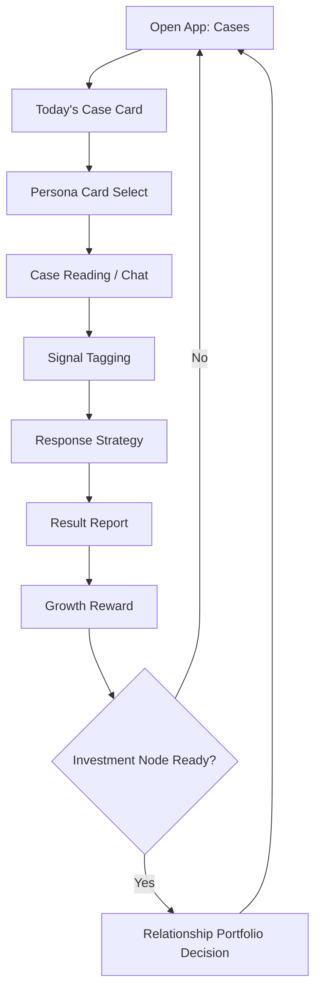

# UI Flow

## Purpose

Define the MVP's vertical mobile information architecture and key screens. This is not a visual design spec. It tells design and engineering what screens must exist, what they prioritize, and how often players use them.

## Platform Assumption

iOS-first vertical mobile prototype.

Design should assume:

- One-handed thumb use.
- Native-feeling chat rhythm.
- Large readable text.
- Shareable report cards.
- Minimal tab switching during the main loop.

## Information Architecture

Primary navigation:

1. **Cases**: default tab, highest frequency.
2. **Growth**: self-improvement, persona cards, stat upgrades.
3. **Portfolio**: relationship investment nodes and active contacts.

The app always opens to **Cases**.

## Screen Priority

| Screen | Frequency | Priority |
| --- | --- | --- |
| Home Case Feed | Very high | Main screen. |
| Case Reading / Chat | Very high | Core interaction. |
| Signal Tagging | Very high | Main judgment action. |
| Response Strategy | Very high | Main agency action. |
| Result Report | Very high | Reward/share screen. |
| Persona Card Select | Medium | Pre-case strategy. |
| Growth Upgrade | Medium | Post-case progression. |
| Portfolio Node | Low | Emotional peak. |
| Contact Detail | Low | Relationship continuity. |

## Flow Overview

## Screen Specs

### Cases Home

Purpose:

- Present one primary case and optional secondary cases.
- Make the next action obvious.

Top area:

- Player stats: Charm, Judgment, Boundary, Social Rank.
- Streak or daily case count.

Main card:

- Male portrait or silhouette.
- Archetype label.
- Hook line.
- Context preview.
- Primary CTA: **Analyze**.

Secondary area:

- Locked premium/high-risk cases.
- Recent result card.
- Portfolio alert when investment node is ready.

### Persona Card Select

Purpose:

- Let the player choose a strategic stance before reading the case.

Card content:

- Name.
- Style image/thumbnail.
- Stat modifiers.
- Risk note.

Required MVP cards:

- Sweet Girl.
- Ice Queen.
- Career Muse.
- Party Star.

### Case Reading / Chat

Purpose:

- Deliver the social evidence.

Layout:

- Chat bubbles for messages.
- Behavior clue cards inserted between chat segments.
- Optional profile snippet at top.

Rules:

- Do not overload with paragraphs.
- Each case should have 5-8 evidence units.
- At least one clue should be behavioral, not verbal.

### Signal Tagging

Purpose:

- Let players identify what the behavior means.

UI:

- Evidence remains visible.
- Tag chips appear below.
- Player selects 2-4 tags.

Feedback:

- No instant correction before response strategy.
- Save reveal for result report.

### Response Strategy

Purpose:

- Turn interpretation into action.

UI:

- 3-4 response options.
- Each option shows tone, not stat math.

Example options:

- Ask clearly.
- Set boundary.
- Cool down.
- Mirror the promise.

### Result Report

Purpose:

- Deliver the emotional payoff.

Required sections:

- True signal.
- Risk score.
- Control shift.
- Emotional cost.
- One-line insight.
- Reward unlocked.

Share format:

- A compact card should be screenshot-worthy without exposing too much UI chrome.

### Growth Upgrade

Purpose:

- Spend points earned from cases.

Stats:

- Charm.
- Judgment.
- Boundary.
- Social Rank.

Upgrade should explain gameplay effect:

- "Judgment Lv. 2: reveals timing mismatch clues."

### Portfolio Node

Purpose:

- Low-frequency relationship investment decision.

Screen content:

- Active contact summary.
- Evidence timeline.
- Current relationship scores.
- Decision choices: Add, Hold, Fold, Test.

Important:

- This screen describes relationship investment as time, attention, emotional access, and identity exposure. It must not imply financial trading or real-world manipulation coaching.

### Contact Detail

Purpose:

- Show continuity for recurring men.

Content:

- Archetype.
- Signal history.
- Player choices.
- Current status.
- Next available node.

## Empty / Locked States

Growth locked state:

- Unlock after first completed case.

Portfolio locked state:

- Unlock after case 3 or first recurring contact.

Premium/high-risk cases:

- Can appear as locked cards, but MVP should not require monetization to complete core loop.

## UI Risks

- If Growth appears as first screen, the game looks like dress-up.
- If Portfolio appears too early, the game feels like a heavy dating sim.
- If Result Report is too long, the game feels like advice content instead of play.
- If Signal Tagging is too obvious, replay and discussion value drop.

## Acceptance Criteria

- The first visible actionable screen is a case.
- A full case can be played without opening Growth or Portfolio manually.
- Growth is visible before/after cases, not dominant.
- Portfolio nodes appear as periodic alerts, not a daily chore.
- Result reports can be captured in one screenshot.

